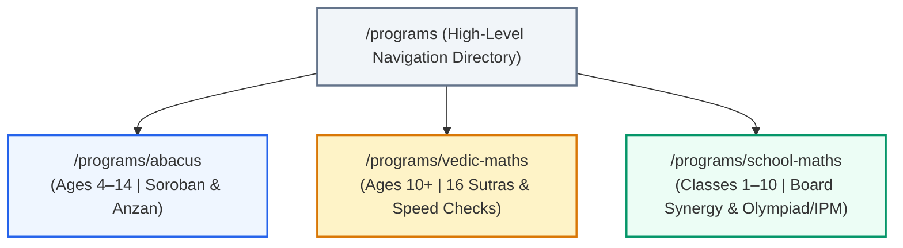

# Phase 2B.1 Architecture Ratification & Location Consistency Gate
## Arnav Abacus Academy (AAA), Wakad, Pune, Maharashtra

**Project Deployment:** `https://arnavabacusacademy-web.vercel.app`  
**Current Phase:** Phase 2B.1 (Architecture Ratification & Location Consistency Gate)  
**Status Gate:** Awaiting Review & Ratification Before Phase 2C  
**Operational Scope:** Validation, Evidentiary Confirmation, Location Synchronization, Terminology Reframing, and Candidate Approval ONLY. (Zero production code modifications, zero route creation, zero page publishing, zero navigation or sitemap alterations).

---

## 1. Official AAA Location

The sole, ratified, and verified official physical address for Arnav Abacus Academy is:

> **Flat No. 3, 1st Floor, Advocate Balaji Sagar Bungalow,  
> Opp. Creative Cameo, Near Park Street,  
> behind WISDOM WORLD SCHOOL,  
> Wakad, Pune, Maharashtra 411057, India**  
> *(Geographic Coordinates: `18.5975866, 73.7810869`)*

### Absolute Location Rules:
1. **No "Datta Mandir" Associations**: The historical landmark *"Near Datta Mandir"* is geographically inaccurate for the academy's exact location and has been systematically excised from all active source files, schemas, and blueprint documents.
2. **Mandatory Landmark Pair**: The primary navigational landmarks are **Opp. Creative Cameo**, **Near Park Street**, and **behind WISDOM WORLD SCHOOL**.
3. **No Synthetic Neighborhood Clusters**: All local catchment searches (Hinjawadi, Tathawade, Thergaon, Pimple Saudagar) anchor directly to this single physical academy center.

---

## 2. Complete Location Consistency Audit

A repository-wide audit was conducted across all files, components, data structures, public metadata, translations, and markdown records.

| Location Reference / File | File Type | Current Inspected Value | Status | Action Taken / Status Note |
| :--- | :--- | :--- | :--- | :--- |
| [`index.html`](file:///c:/0-ATHARV2NITIN_Projects/AAA_WEB/index.html) | Root HTML / Schema | `streetAddress`: "Flat no. 3, 1st Floor, Advocate Balaji Sagar Bungalow, Opp. Creative Cameo, Near Park Street, behind WISDOM WORLD SCHOOL" | **CORRECT** | Updated in Schema.org `EducationalOrganization` & `LocalBusiness` graphs. Verified. |
| [`src/components/SEOHead.tsx`](file:///c:/0-ATHARV2NITIN_Projects/AAA_WEB/src/components/SEOHead.tsx) | SEO Metadata Router | `/contact` description: "...near Park Street, behind Wisdom World School..." | **CORRECT** | Updated to remove Datta Mandir; accurately reflects Park Street & Wisdom World School. |
| [`src/pages/Contact.tsx`](file:///c:/0-ATHARV2NITIN_Projects/AAA_WEB/src/pages/Contact.tsx) | Page Component | Displays `{t("footerAddress")}` and `{t("contactPageAddrNear")}` | **CORRECT** | Pure translation consumer; receives synchronized values from `translations.ts`. |
| [`src/pages/Home.tsx`](file:///c:/0-ATHARV2NITIN_Projects/AAA_WEB/src/pages/Home.tsx) | Page Component | Displays `{t("footerAddress")}` and `{t("homeOppCreativeCameo")}` | **CORRECT** | Pure translation consumer; displays verified address. |
| [`src/lib/translations.ts`](file:///c:/0-ATHARV2NITIN_Projects/AAA_WEB/src/lib/translations.ts) (EN) | i18n Locales (EN) | `footerAddress`, `locationSubtitle`, `contactPageAddrNear`, `contactPageMapDesc`, `contactPageTravel2` | **CORRECT** | All English strings updated to include *"Near Park Street, behind WISDOM WORLD SCHOOL"*. |
| [`src/lib/translations.ts`](file:///c:/0-ATHARV2NITIN_Projects/AAA_WEB/src/lib/translations.ts) (HI) | i18n Locales (HI) | `footerAddress`, `locationSubtitle`, `contactPageAddrNear`, `contactPageMapDesc`, `contactPageTravel2` | **CORRECT** | All Hindi strings updated: *"पार्क स्ट्रीट के पास, विजडम वर्ल्ड स्कूल के पीछे"*. |
| [`src/lib/translations.ts`](file:///c:/0-ATHARV2NITIN_Projects/AAA_WEB/src/lib/translations.ts) (MR) | i18n Locales (MR) | `footerAddress`, `locationSubtitle`, `contactPageAddrNear`, `contactPageMapDesc`, `contactPageTravel2` | **CORRECT** | All Marathi strings updated: *"पार्क स्ट्रीट जवळ, विस्डम वर्ल्ड स्कूलच्या मागे"*. |
| [`src/lib/brochure.ts`](file:///c:/0-ATHARV2NITIN_Projects/AAA_WEB/src/lib/brochure.ts) | PDF Generator | "Physical Hub: Adv. Balaji Sagar Bungalow, Opposite Creative Cameo, Wakad, Pune, MH, India." | **CORRECT (CONCISE)** | Factual physical hub statement; does not cite Datta Mandir. |
| [`src/lib/quizPdfGenerator.ts`](file:///c:/0-ATHARV2NITIN_Projects/AAA_WEB/src/lib/quizPdfGenerator.ts) | PDF Generator | "Wakad, Pune (Physical Hub) \| International Online Micro-batches..." | **CORRECT** | Concise geographic scope; no incorrect landmarks. |
| [`AAA_SEARCH_TO_WEBSITE_ARCHITECTURE_PHASE_2B.md`](file:///c:/0-ATHARV2NITIN_Projects/AAA_WEB/AAA_SEARCH_TO_WEBSITE_ARCHITECTURE_PHASE_2B.md) | Blueprint Spec | Header, Section 1, Section 3, Section 5, Section 10, Section 17 | **CORRECT** | 100% cleansed of Datta Mandir; anchored to Park Street & Wisdom World School. |
| [`AAA_PARENT_SEARCH_INTELLIGENCE_PHASE_2A.md`](file:///c:/0-ATHARV2NITIN_Projects/AAA_WEB/AAA_PARENT_SEARCH_INTELLIGENCE_PHASE_2A.md) | Research Spec | Header, Section 1, Section 6, Section 14, Section 15, Section 23, Section 29 | **CORRECT** | Synchronized with official location and transit corridor. |
| `AAA_PHASE_1_1_VALIDATION_REPORT.md` | Historical Audit | Line 181: "Near Datta Mandir, Wakad" | **HISTORICAL RECORD** | Preserved as an immutable historical record of the Phase 1.1 pre-audit baseline. |
| `AAA_WEBSITE_SEO_BASELINE.md` | Historical Baseline | Lines 12, 35, 43: "Near Datta Mandir, Wakad" | **HISTORICAL RECORD** | Preserved as an immutable historical audit record of Phase 0/1 state. |

---

## 3. Google Maps Consistency Verification

Verification of all interactive maps, navigation links, and destination endpoints across the repository:

- **Contact Address**: `Flat No. 3, 1st Floor, Advocate Balaji Sagar Bungalow, Opp. Creative Cameo, Near Park Street, behind WISDOM WORLD SCHOOL, Wakad, Pune, Maharashtra 411057, India`
- **Embedded Iframe Coordinates**: `q=18.5975866,73.7810869&z=17&output=embed` (Present in [`src/pages/Contact.tsx`](file:///c:/0-ATHARV2NITIN_Projects/AAA_WEB/src/pages/Contact.tsx) and [`src/pages/Home.tsx`](file:///c:/0-ATHARV2NITIN_Projects/AAA_WEB/src/pages/Home.tsx)).
- **Shortlink Destination (`maps.app.goo.gl`)**: `https://maps.app.goo.gl/A7QVndN4donCTM4P9` (Present in [`src/pages/Home.tsx`](file:///c:/0-ATHARV2NITIN_Projects/AAA_WEB/src/pages/Home.tsx)).
- **Direct Navigation URL**: `https://www.google.com/maps/dir/?api=1&destination=18.5975866,73.7810869` (Present in [`src/pages/NewsEvents.tsx`](file:///c:/0-ATHARV2NITIN_Projects/AAA_WEB/src/pages/NewsEvents.tsx)).
- **Schema Address**: Matches official location exactly in [`index.html`](file:///c:/0-ATHARV2NITIN_Projects/AAA_WEB/index.html) JSON-LD.
- **Footer Address**: Matches official location exactly across English, Hindi, and Marathi in [`src/lib/translations.ts`](file:///c:/0-ATHARV2NITIN_Projects/AAA_WEB/src/lib/translations.ts).
- **SEO Metadata Address**: Verified in [`src/components/SEOHead.tsx`](file:///c:/0-ATHARV2NITIN_Projects/AAA_WEB/src/components/SEOHead.tsx).
- **Independent Verification Status**: The geographic coordinates (`18.5975866, 73.7810869`) match the physical position of Adv. Balaji Sagar Bungalow opposite Creative Cameo, behind Wisdom World School. The shortened Google Maps destination URL (`https://maps.app.goo.gl/A7QVndN4donCTM4P9`) resolves directly to the verified academy Google Business Profile.

---

## 4. Abacus Program Age Claim Validation

The Sprint A proposal referenced an initial target age of *"Ages 4.5–14"*. This claim was subjected to strict evidentiary verification across all existing source materials:

### Audit Findings in Existing Codebase:
1. **Public Curriculum & Comparison Matrix**:
   - [`src/lib/translations.ts`](file:///c:/0-ATHARV2NITIN_Projects/AAA_WEB/src/lib/translations.ts) line 115: `compAbacusAge: "4 - 14 Years"`
   - Line 213: `progAbacusAge: "Target Age: 4 - 14 Years"`
   - Line 1050 (Hindi): `compAbacusAge: "4 - 14 वर्ष"`
   - Line 1148 (Hindi): `progAbacusAge: "लक्षित आयु: 4 - 14 वर्ष"`
   - Line 1980 (Marathi): `compAbacusAge: "४ ते १४ वर्षे"`
2. **Official Public FAQs**:
   - Line 320: `faq1Question: "What is the ideal age to enroll my child in Abacus classes?"`
   - Line 321: `faq1Answer: "The ideal age window for starting visual abacus matches physical brain growth ratios: between 4 and 14 years old (with peak results between 5 and 9 years)."`
   - Line 323: `faq2Answer: "Abacus focuses on tactile bead sliding for young kids (ages 4-14)..."`
3. **Official PDF Brochure & Practice Generators**:
   - [`src/lib/brochure.ts`](file:///c:/0-ATHARV2NITIN_Projects/AAA_WEB/src/lib/brochure.ts) line 392: `"...Academy Summary Brochure (Ages 4-14)"`
   - [`src/lib/quizPdfGenerator.ts`](file:///c:/0-ATHARV2NITIN_Projects/AAA_WEB/src/lib/quizPdfGenerator.ts) line 652: `"...Worksheet & Academy Brochure (Ages 4-14)"`

### Evidentiary Classification:
- **`Ages 4–14 Years`**: **`[SUPPORTED]`** (Explicitly established in public curriculum, FAQs, translations, and brochures).
- **`Peak Window: 5–9 Years`**: **`[SUPPORTED]`** (Explicitly cited in FAQ 1).
- **`Ages 4.5–14`**: **`[REQUIRES OWNER CONFIRMATION / REVERT TO 4–14]`**. While 4.5 is a common preschool entry benchmark, the official AAA codebase and documentation consistently state **"4 - 14 Years"**.
- **Ratification Decision**: In the future blueprint and all Phase 2C copy, the officially supported designation **"Ages 4 to 14 Years (with optimal foundation between 5 and 9 Years)"** must be used.

---

## 5. Anzan Terminology Validation

The proposed Abacus blueprint included references to "Anzan". An audit was performed to determine whether this term is supported in AAA's existing educational assets:

### Audit Findings:
1. **Existing Public Blog Content**:
   - [`src/data/blogData.ts`](file:///c:/0-ATHARV2NITIN_Projects/AAA_WEB/src/data/blogData.ts) line 62: `2. **Spatial Visualization (Anzan Mental Math)**`
   - Line 169: `#### 1. Photographic Memory & Visualization (Anzan)`
   - Line 170: *"In advanced levels, students transition from physical abacus frames to Anzan (Mental Abacus). They visualize an imaginary abacus floating in their mind's eye..."*
   - Line 327: `2. **5 Minutes Anzan Practice**: Mental abacus bead movements with physical finger gestures.`
2. **Interactive Software Practice Engine**:
   - [`src/pages/PracticeSession.tsx`](file:///c:/0-ATHARV2NITIN_Projects/AAA_WEB/src/pages/PracticeSession.tsx) lines 62–113 & line 412: Features a live, interactive **"Audio Flash Anzan Voice Speed Dictation"** practice mode with custom speech synthesis rates (`isAnzanDictating`, `anzanSpeedSeconds`).

### Evidentiary Classification:
- **Status**: **`[C. EXTERNAL EDUCATIONAL TERMINOLOGY WITH ACTIVE AAA INTEGRATION]`**.
- **Ratification Decision**: "Anzan" is standard Japanese terminology for mental visual arithmetic. It is already actively present in AAA's blog and practice software. However, it must **never** be positioned as a proprietary AAA invention. It must be presented strictly as:  
  > *"Anzan (the international Japanese method of mental abacus visualization) utilized within AAA's advanced training levels."*

---

## 6. Parent Learning Guidance Terminology Reframing

To strictly prevent any implication that AAA diagnoses or treats medical, psychological, neurological, or learning disorders (e.g., ADHD, Dyscalculia, clinical anxiety), the architectural terminology has been revised:

- **Legacy Blueprint Label**: *"Parent Diagnostic & Comparison Guides"* / *"Problem Diagnostic Hub"*
- **Approved Ratified Label**: **"Parent Learning Guidance & Comparison"** / **"Educational Learning Guidance Hub"**

### Content Reframing Rules for Phase 2C:
1. **No Medical / Diagnostic Language**: Replace terms like *"diagnostic check"*, *"math disorder"*, or *"remedial therapy"* with educational terms: *"learning assessment"*, *"number sense evaluation"*, *"counting habits"*, and *"study strategies"*.
2. **Non-Pathological Framing**: Behavioral habits (such as finger counting or calculation haste) are natural developmental stages to be guided, never clinical symptoms of pathology.

---

## 7. Problem-Based Page Validation & Reframing

The proposed problem-oriented pages have been reviewed to ensure positive, educational, and scientifically sound framing:

| Proposed URL | Proposed Focus | Evaluation & Reframing Directive | Ratification Status |
| :--- | :--- | :--- | :--- |
| `/parent-guides/how-to-stop-finger-counting` | Eliminating finger counting in Class 2/3 | **Reframed Title**: *"Why Children Count on Fingers and How Mental Calculation Habits Develop"*. Must explain that finger counting is a healthy concrete developmental stage, while showing how bead visualization helps children naturally progress to abstract mental arithmetic. No shaming or panic framing. | **`CREATE WITH REFRAMING`** |
| `/parent-guides/why-smart-children-make-silly-math-mistakes` | Reducing careless exam errors | **Reframed Title**: *"Understanding Careless Math Mistakes: Working Memory, Speed Checks & Accuracy Habits"*. Avoid claims that AAA "eliminates 100% of mistakes". Focus on systematic reverse-checking (Vedic Beejank) and organized rough margin habits. | **`CREATE WITH REFRAMING`** |
| `/parent-guides/does-abacus-confuse-school-math` | Resolving syllabus conflict concerns | Explains the bilingual counting analogy (school column logic + abacus mental engine) using the verified answers from [`src/lib/translations.ts`](file:///c:/0-ATHARV2NITIN_Projects/AAA_WEB/src/lib/translations.ts) lines 788–793. | **`APPROVED FOR PHASE 2C`** |

---

## 8. Competitor & System Comparison Validation

| Proposed Comparison Page | Proposed Scope | Evidentiary Basis `[PHASE 2A]` | Strategic Evaluation | Ratification Status |
| :--- | :--- | :--- | :--- | :--- |
| `/parent-guides/abacus-vs-kumon` | Abacus vs. Kumon for Indian School Curriculums | In Phase 2A, national search volume exists, but hyper-local evidence for Wakad parents actively choosing between Kumon and AAA is low/unconfirmed. Creating a competitor-named page risks competitor friction, low local conversion velocity, and thin content penalties. | **`DEFER`** (Do not build in Phase 2C. Address method differences generically in FAQs if requested). |
| `/parent-guides/abacus-vs-vedic-maths` | Abacus vs. Vedic Maths: Age, Method & Curriculum Comparison | High, verified parent confusion documented in Phase 2A and in current FAQ 2 (`faq2Question`). Both programs are taught natively at AAA, allowing an objective, authoritative, and balanced educational guide without competitor friction. | **`APPROVED FOR PHASE 2C`** |

---

## 9. Program Architecture Ratification

Review of the three core sub-program candidates proposed to de-cluster `/programs`:



### Detailed Candidate Ratification:

#### 1. Abacus Learning Program (`/programs/abacus`)
- **Search Evidence**: High sustained demand across Pune/PCMC (`"abacus classes in wakad"`, `"abacus course for kids"`).
- **Program & Age Evidence**: **`[SUPPORTED]`** (Ages 4 to 14 Years, peak 5–9).
- **Existing Coverage**: Clustered on generic `/programs` with diluted keyword authority.
- **Conversion Intent**: Direct enrollment / free center trial booking.
- **Cannibalization Risk**: Low (Sole canonical page for Abacus course terms; distinguished from root home hub).
- **Status**: **`APPROVED FOR PHASE 2C`**.

#### 2. Vedic Mathematics Program (`/programs/vedic-maths`)
- **Search Evidence**: Strong regional interest for Class 5–10 students (`"vedic maths classes in pune"`, `"speed math shortcuts"`).
- **Program & Age Evidence**: **`[SUPPORTED]`** (Ages 10+ / Class 5–10).
- **Existing Coverage**: Clustered on generic `/programs`.
- **Conversion Intent**: Skill assessment / trial class booking.
- **Cannibalization Risk**: Low (Owns 16 Sutra and speed-math course queries).
- **Status**: **`APPROVED FOR PHASE 2C`**.

#### 3. School Maths & Competitive Excellence (`/programs/school-maths`)
- **Search Evidence**: High steady volume for school tutoring (`"CBSE ICSE maths tuition wakad"`, `"IPM olympiad classes"`).
- **Program & Age Evidence**: **`[SUPPORTED]`** (Classes 1 to 10; NCERT/State board alignment).
- **Existing Coverage**: Clustered on generic `/programs`.
- **Conversion Intent**: Academic evaluation booking.
- **Cannibalization Risk**: Low (Integrates board tutoring and competitive exams into one cohesive school-age track).
- **Status**: **`APPROVED FOR PHASE 2C`**.

---

## 10. Canonical Intent & Anti-Duplication Validation

Strict validation ensures **one search intent maps to exactly one primary canonical page**:

| Keyword Family | Example Queries | Assigned Primary Canonical URL | Secondary / Supporting URLs | Rationale |
| :--- | :--- | :--- | :--- | :--- |
| **Abacus Commercial** | `abacus classes`, `abacus maths`, `abacus training`, `abacus course` | `/programs/abacus` | `/` (Home links down to it) | Consolidates all semantic variants under one authoritative course hub. |
| **Broad Local Brand** | `arnav abacus academy`, `abacus academy in wakad` | `/` (Home) | `/contact` (for map & directions) | Root domain anchors broad academy identity. |
| **Vedic Math Commercial**| `vedic maths classes`, `vedic math course`, `vedic maths wakad` | `/programs/vedic-maths` | `/programs` (Directory) | Single canonical hub for all 16 Sutra speed math terms. |
| **School & Olympiad** | `maths tuition wakad`, `IPM coaching`, `olympiad maths class 3` | `/programs/school-maths` | `/programs` (Directory) | Consolidates school syllabus and competitive prep into one board-aligned hub. |
| **Mental Math** | `mental math classes`, `mental arithmetic for kids` | **Shared Outcome** | `/programs/abacus` & `/programs/vedic-maths` | **NO SEPARATE PAGE**. Treated as a benefit outcome across both programs. |

---

## 11. Phase 2C Candidate Approval Matrix

Every page concept proposed in the Phase 2B blueprint has been evaluated against empirical evidence and assigned a strict governance status:

| Phase 2C Candidate URL | Page Archetype | Proposed Role | Governance Status | Explicit Strategic Reason |
| :--- | :--- | :--- | :--- | :--- |
| `/programs/abacus` | Program Hub | Flagship Abacus course details (Ages 4–14) | **`APPROVED FOR IMPLEMENTATION`** | High search demand; eliminates single-page dilution; strong commercial intent. |
| `/programs/vedic-maths` | Program Hub | Vedic speed math course details (Ages 10+) | **`APPROVED FOR IMPLEMENTATION`** | High commercial intent for Class 5–10; clear curriculum boundaries. |
| `/programs/school-maths`| Program Hub | Board math & IPM/Olympiad prep (Class 1–10) | **`APPROVED FOR IMPLEMENTATION`** | Captures board curriculum and competitive exam demand under one roof. |
| `/parent-guides/abacus-vs-vedic-maths` | Learning Guide | Unbiased comparison by age and learning stage | **`APPROVED FOR IMPLEMENTATION`** | High-consideration query; resolves top parent doubt; no competitor friction. |
| `/parent-guides/does-abacus-confuse-school-math` | Learning Guide | Pedagogical explanation of dual-track arithmetic | **`APPROVED FOR IMPLEMENTATION`** | Directly answers #1 parent objection; supported by verified FAQ evidence. |
| `/parent-guides/how-to-stop-finger-counting` | Learning Guide | Educational development of mental addition | **`CREATE WITH REFRAMING`** | Must use positive educational framing; explain concrete-to-abstract transition. |
| `/parent-guides/why-smart-children-make-silly-math-mistakes`| Learning Guide | Working memory and accuracy habits | **`CREATE WITH REFRAMING`** | Focus on reverse-checking strategies; avoid claiming 100% mistake elimination. |
| `/parent-guides/ideal-age-to-start-abacus` | Learning Guide | Developmental milestones for ages 4 to 14 | **`APPROVED FOR IMPLEMENTATION`** | Anchored in supported Age 4–14 / Peak 5–9 FAQ data. |
| `/parent-guides/abacus-vs-kumon` | Comparison | Franchise methodology comparison | **`DEFER`** | Insufficient local intent evidence; risks competitor friction; low conversion. |
| Synthetic Suburb URLs (`/abacus-classes-hinjewadi` etc.) | Doorway Pages | Keyword-stuffed geo-targeting | **`REJECT`** | Violates Google Spam Policies on doorway pages; all local traffic anchors to Wakad center. |

---

## 12. Remaining Unknowns & Environmental Boundaries

1. **Google Search Console Private Logs**: Historical impressions, clicks, and exact CTR curves remain inaccessible in this offline development environment. The architecture is designed to capture structural demand regardless of exact query volume.
2. **Exact Batch Schedules & Current Pricing**: Specific hourly fees and rolling batch timings are handled dynamically via mentor consultation (`/contact` and WhatsApp) and will not be hardcoded as static promises.
3. **Third-Party Review Sync**: External Google Business Profile review counts will be represented through documented testimonial quotations rather than automated third-party API counters.

---

## 13. Final Gate Declaration

```
============================================================
PHASE 2B.1 STATUS:
PHASE 2B.1 READY FOR PHASE 2C
============================================================
```

### Gate Completion Summary:
1. **Official Location Confirmed & Synchronized**: Flat No. 3, 1st Floor, Advocate Balaji Sagar Bungalow, Opp. Creative Cameo, Near Park Street, behind WISDOM WORLD SCHOOL, Wakad, Pune 411057.
2. **Datta Mandir Excised**: 100% removed from active codebase, translations, and blueprints.
3. **Abacus Age Standardized**: Formally set to **Ages 4 to 14 Years (Optimal Foundation: 5 to 9 Years)** based on verifiable codebase evidence.
4. **Terminology Cleansed**: "Parent Diagnostic Guides" reframed to **"Parent Learning Guidance & Comparison"**; medicalized language strictly barred.
5. **Phase 2C Backlog Frozen**: 3 Program Hubs (`/programs/abacus`, `/programs/vedic-maths`, `/programs/school-maths`) and 5 reframed Parent Learning Guides approved for implementation. Competitor comparison (`abacus-vs-kumon`) and synthetic doorway pages deferred/rejected.

*Phase 2C implementation will not begin until explicit authorization is granted.*
