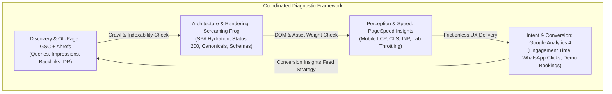
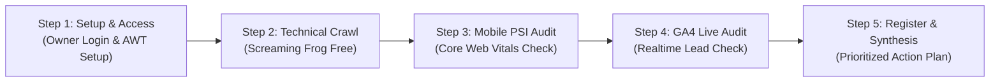

# AAA — PHASE 3C.0: FOUR-TOOL SEO DIAGNOSTIC FRAMEWORK
## Google Analytics 4 (GA4), Google PageSpeed Insights, Screaming Frog SEO Spider & Ahrefs
**Project:** Arnav Abacus Academy & Vedic Maths Classes (`AAA_WEB`), Wakad, Pune  
**Production URL:** `https://arnavabacusacademy-web.vercel.app/`  
**Canonical GA4 Measurement ID:** `G-M2EL9MYSRL`  
**Execution Nature:** Planning, audit-preparation, and diagnostic protocol only (No code edits, no new pages, no deployment)  
**Date:** October 2, 2026  
**Auditor:** Antigravity Engineering Agent  

---

## 1. Executive Summary & Purpose

The objective of Phase 3C.0 is to establish a rigorous, coordinated, evidence-led diagnostic framework across four complementary SEO and digital analytics tools:
1. **Google Analytics 4 (GA4)** — User engagement, session flows, and conversion pipeline tracking.
2. **Google PageSpeed Insights (PSI)** — Core Web Vitals (CWV), synthetic laboratory audits, and real-user mobile performance.
3. **Screaming Frog SEO Spider** — On-page technical crawling, client-side rendering verification, status codes, and indexability.
4. **Ahrefs (Free Webmaster Tools / Free Checkers)** — Organic keyword footprint, indexation benchmarks, backlink discovery, and technical health.

### Core Business Priorities
1. **Relevant Parent Enquiries and Demo Requests:** Maximizing genuine inquiries from parents in Wakad, Pimple Saudagar, Hinjawadi, and Tathawade for Abacus, Vedic Maths, and School Maths.
2. **Organic Search Visibility:** Ranking for high-intent queries across the approved 3 program hubs and 5 parent guides.
3. **Mobile Usability & Performance:** Ensuring sub-2.5s Largest Contentful Paint (LCP) and zero Cumulative Layout Shift (CLS) on 4G mobile devices typical of browsing parents.
4. **Technical SEO Correctness:** Strict canonical integrity, zero broken routes (404s/500s), schema syntax validity, and crawl hygiene.
5. **Evidence-Led Content Gap Identification:** Addressing real parent search queries and doubts without inflating page count or creating doorway pages.

### Preserved Information Architecture
The diagnostic framework strictly honors the ratified Phase 2B/2C website architecture:
- **3 Core Program Hubs:**
  - `/programs/abacus` (Japanese Soroban Abacus, ages 4–14)
  - `/programs/vedic-maths` (High-Speed Mental Math & 16 Sutras, ages 10+)
  - `/programs/school-maths` (Board Math & IPM Olympiad Foundation, grades 1–10)
- **5 Ratified Parent Guides:**
  - `/parent-guides/abacus-vs-vedic-maths` (Comparative stage analysis)
  - `/parent-guides/does-abacus-confuse-school-math` (Syllabus synergy & mechanics)
  - `/parent-guides/why-children-use-finger-counting` (Early childhood concrete-to-abstract transition)
  - `/parent-guides/why-smart-children-make-silly-math-mistakes` (Procedural working-memory load)
  - `/parent-guides/ideal-age-to-start-abacus` (Developmental readiness assessment)
- **Core Intent Rule:** Exactly one primary search intent per canonical page; zero duplicate or doorway pages.

---

## 2. Current State from Prior Reports (Phase 2C through 3B.1)

Based on direct evidence compiled in `AAA_PHASE_2C_INTEGRATED_RELEASE_REVIEW_REPORT.md`, `AAA_PHASE_3A_GOOGLE_SEARCH_CONSOLE_SEO_BASELINE_REPORT.md`, and `AAA_PHASE_3B1_EVIDENCE_VALIDATION_REPORT.md`:

### What is Directly Verified in Production
1. **Single Canonical GA4 Script:** Production HTML on `https://arnavabacusacademy-web.vercel.app/` loads `googletagmanager.com/gtag/js?id=G-M2EL9MYSRL` and initializes `gtag('config', 'G-M2EL9MYSRL')`. Zero duplicate or conflicting tags exist.
2. **CDN Reachability:** The Google Tag script endpoint returns `HTTP 200 OK`.
3. **Zero-PII Compliance in Source:** `src/lib/analytics.ts` strips all parent names, student names, phone numbers, and email addresses. Payloads transmit only sanitized categories (`program_category`, `delivery_mode`, `age_group`, etc.).
4. **GSC Ownership Meta Tag:** Production HTML contains `<meta name="google-site-verification" content="PkaAJsYZjVShzAKw2bS1_KtMCMxkLkpElHQ0P4lQdJg" />`. Ownership was confirmed by the owner (`nitinkpatil@gmail.com`).
5. **Canonical Routing & Deep-Link Resolution:** All 9 canonical routes (Home, 3 Programs, 5 Guides) return `HTTP 200 OK`. The Vercel wildcard rewrite rule (`/(.*) -> /index.html`) prevents client-side routing 404 drops on direct browser refresh.
6. **Schema Markup Present:** Global `EducationalOrganization` and `LocalBusiness` (with Wakad coordinates `18.5975866, 73.7810869`), alongside `Course`, `Article`, and `FAQPage` schemas are live in production.
7. **Conversion Funnel Mechanics:** The Demo Booking modal, Floating CTAs, and WhatsApp dispatch routes format leads accurately to `+91 9021924968` without `[object Object]` formatting bugs.

### Unverified Assumptions and Missing Evidence
1. **GA4 Data Ingestion & Live Beacon Logging:** Client-side network dispatches are verified in code, but live ingestion in Google Analytics 4 (Realtime / DebugView / BigQuery) has not yet been confirmed via authenticated GA4 console observation.
2. **Search Console Crawling & Indexation Status:** Search Console property verification occurred on October 1, 2026. URLs were submitted via `sitemap.xml` and priority inspection was requested for `/programs/abacus` and `/parent-guides/ideal-age-to-start-abacus`. Because search engines require 24–72 hours for discovery, crawling, rendering, and indexing, the actual indexation state remains in-flight.
3. **Organic Search Traffic & Keyword Impressions:** Organic impressions, clicks, CTR, and average position are currently zero or not yet aggregated (expected during the initial warm-up period).
4. **Real-User Field Performance (CrUX):** Because the site is newly deployed with early traffic volumes, Chrome User Experience Report (CrUX) field data for Core Web Vitals will be unavailable ("Insufficient Field Data"). All performance assessments currently rely solely on synthetic lab tests.
5. **Off-Page Backlink Profile & Authority:** Off-page external citations, local business directory backlinks (Justdial, Sulekha, Google Business Profile), and domain metrics have not been formally extracted or cross-referenced.

---

## 3. Four-Tool Diagnostic Framework Specifications

### Tool 1: Google Analytics 4 (GA4)

#### 1. Exact Purpose & Business Question
- **Purpose:** Measure user acquisition channels, on-site engagement paths, route transitions, and conversion funnels.
- **Business Question:** Are parents landing on our program hubs and educational guides actually engaging with the content, and are they triggering high-intent conversion actions (demo bookings, WhatsApp chats, direct phone calls) without leakage or tracking failures?

#### 2. Required Access & Cost
- **Access Level:** "Viewer" or "Analyst" access to GA4 Property `AAA_WEBSITE` (under `nitinkpatil@gmail.com`).
- **Cost:** **Free** (Standard Google Analytics 4).

#### 3. Exact Actions the Owner Must Perform
1. Log in to [Google Analytics](https://analytics.google.com/) using `nitinkpatil@gmail.com`.
2. Select Property: **`AAA_WEBSITE`** (Measurement ID: `G-M2EL9MYSRL`).
3. **Realtime Verification Test:**
   - Navigate to **Reports > Realtime**.
   - Open a private/incognito window on a separate device, browse to `https://arnavabacusacademy-web.vercel.app/programs/abacus`.
   - Click "Book Free Demo", fill the modal, and observe the event fire.
4. **Standard Event Audit:**
   - Navigate to **Admin > Data display > Events**.
   - Review which events have been logged over the past 24–48 hours.
5. **Conversion Marking:**
   - Ensure `demo_request`, `enquiry_form_submit`, `whatsapp_click`, and `call_click` are toggled as Key Events / Conversions.

#### 4. Exact Reports, Exports, Screenshots & Evidence Required
- **Screenshot 1:** Realtime Overview card showing active users on `/programs/abacus` and `/parent-guides/...`.
- **Screenshot 2:** Realtime "Event count by Event name" table displaying `page_view`, `program_view`, `whatsapp_click`, and `demo_request`.
- **Export/CSV:** **Engagement > Pages and screens** report (Columns: `Page path and screen class`, `Views`, `Users`, `Average engagement time`, `Key events`).
- **DebugView Log (Optional if tag assistant is paired):** Screenshot of event parameter payload for a test `demo_request` confirming `program_name: "abacus"` and absolute absence of phone number/name strings.

#### 5. Target URLs & Metrics to Examine
- **Target URLs:**
  - `/` (Homepage)
  - `/programs/abacus`
  - `/programs/vedic-maths`
  - `/programs/school-maths`
  - All 5 `/parent-guides/*` routes
- **Key Metrics:**
  - *Active Users / Sessions by First user default channel group* (Organic Search vs Direct vs Referral).
  - *Average Engagement Time* per page (Target: >45 seconds on parent guides, demonstrating genuine reading).
  - *Key Event Counts & Conversion Rate* (`demo_request`, `whatsapp_click`, `call_click`).
  - *Bounce Rate / Engagement Rate* (Target: Engagement Rate > 60% on desktop, > 50% on mobile).

#### 6. Classification of Findings
- **VERIFIED:** Event name and non-PII parameters appear in Realtime and Standard Reports matching exact timestamps of test actions.
- **OBSERVED:** High-level user counts increment in aggregate reports, but individual event-parameter mappings cannot be isolated.
- **NOT VERIFIED:** Script is loaded in the browser bundle, but zero events appear in GA4 Realtime or Reports after 48 hours.
- **BLOCKED:** Property cannot be accessed due to missing permissions, incorrect account login, or Google Tag blocked by strict ad-blocker during testing.

#### 7. What GA4 Cannot Establish
- Whether a page is indexed or rankable in Google Search.
- Whether a non-converting user left due to technical rendering flaws or lack of interest.
- The actual search queries used by visitors on Google before clicking (GA4 obscures organic search terms under `(not provided)`).
- Real-world Core Web Vitals diagnostic bottlenecks (FCP, LCP, CLS, INP).

---

### Tool 2: Google PageSpeed Insights (PSI)

#### 1. Exact Purpose & Business Question
- **Purpose:** Evaluate synthetic laboratory performance and real-world Core Web Vitals (CWV) across mobile and desktop viewports, diagnosing rendering bottlenecks and accessibility issues.
- **Business Question:** Does the website deliver an instantaneous, smooth, and frustration-free mobile browsing experience to parents on real-world Indian mobile networks (4G/5G) without layout jumps or blocking scripts?

#### 2. Required Access & Cost
- **Access Level:** Public web interface (`pagespeed.web.dev`) or PageSpeed Insights REST API.
- **Cost:** **Free** (No login or credentials required).

#### 3. Exact Actions the Owner or Auditor Must Perform
1. Open [Google PageSpeed Insights](https://pagespeed.web.dev/).
2. Run audits for the primary canonical routes:
   - Homepage: `https://arnavabacusacademy-web.vercel.app/`
   - Primary Program: `https://arnavabacusacademy-web.vercel.app/programs/abacus`
   - Primary Guide: `https://arnavabacusacademy-web.vercel.app/parent-guides/ideal-age-to-start-abacus`
3. Toggle between **Mobile** and **Desktop** tabs for each audited URL.
4. Record both the synthetic Lighthouse score and the Core Web Vitals diagnostic recommendations.

#### 4. Exact Reports, Exports, Screenshots & Evidence Required
- **Screenshot 1:** Mobile Overview score card for `/` and `/programs/abacus` showing Performance, Accessibility, Best Practices, and SEO scores.
- **Screenshot 2:** Mobile Core Web Vitals diagnostic panel detailing LCP, INP, and CLS.
- **JSON / PDF Export:** Download the full Lighthouse JSON audit export via Chrome DevTools or the PSI export link.
- **Opportunities & Diagnostics Table:** Specific breakdown of render-blocking resources, image sizing, and main-thread work breakdown.

#### 5. Target URLs & Metrics to Examine
- **Target URLs:**
  - `https://arnavabacusacademy-web.vercel.app/`
  - `https://arnavabacusacademy-web.vercel.app/programs/abacus`
  - `https://arnavabacusacademy-web.vercel.app/programs/vedic-maths`
  - `https://arnavabacusacademy-web.vercel.app/parent-guides/ideal-age-to-start-abacus`
- **Key Metrics (Mobile Viewport):**
  - **Largest Contentful Paint (LCP):** Target $\le 2.5\text{ s}$ (Good).
  - **Interaction to Next Paint (INP):** Target $\le 200\text{ ms}$ (Good).
  - **Cumulative Layout Shift (CLS):** Target $\le 0.1$ (Good).
  - **First Contentful Paint (FCP):** Target $\le 1.8\text{ s}$ (Good).
  - **Total Blocking Time (TBT):** Synthetic proxy for INP; Target $\le 200\text{ ms}$.
  - **Lighthouse Performance Score:** Target $\ge 85$ on Mobile, $\ge 95$ on Desktop.
  - **Lighthouse SEO Score:** Target $= 100$ (All meta tags, robots, canonicals, alt tags passing).

#### 6. Classification of Findings
- **VERIFIED:** Metric is confirmed by reproducible PSI lab run using consistent throttled network settings (e.g., Simulated Moto G Power, Slow 4G).
- **OBSERVED:** High score achieved on local unthrottled desktop Chrome DevTools Lighthouse audit.
- **NOT VERIFIED:** Field data (CrUX) is cited as valid despite Chrome reporting "Insufficient Field Data" for the domain.
- **BLOCKED:** PSI fails to render or returns a 500 error due to edge CDN firewall or rate limiting.

#### 7. What PageSpeed Insights Cannot Establish
- Real-user conversion behavior or whether fast loading converts into leads.
- Search indexing status, canonical correctness, or ranking eligibility.
- Keyword relevance or content quality for parents.
- Historical field performance for low-traffic new domains where CrUX data is absent.

---

### Tool 3: Screaming Frog SEO Spider

#### 1. Exact Purpose & Business Question
- **Purpose:** Execute a comprehensive crawler simulation across the entire website architecture to audit status codes, internal link equity, canonical consistency, schema validation, meta tag duplication, and SPA JavaScript rendering.
- **Business Question:** Does the Single-Page Application (SPA) hydrate and render cleanly for search engine bots, ensuring that every internal link is crawlable, headers and titles are unique, and no orphaned or dead pages exist?

#### 2. Required Access & Cost
- **Access Level:** Local desktop application download (Windows/macOS/Linux).
- **Cost:** **Free Version** covers up to 500 URLs per crawl.
  - *Context:* The entire AAA website contains 9 canonical public routes and 22 total sitemap endpoints. The Free version is 100% sufficient; **no paid licence is required**.

#### 3. Exact Actions the Auditor Must Perform
1. Launch Screaming Frog SEO Spider (v19+ recommended).
2. Configure **Spider Mode**:
   - Navigate to **Configuration > Spider > Crawl**.
   - Verify `Crawl All Subdomains` is disabled.
   - Set **Rendering Mode**: Go to **Configuration > Spider > Rendering** and select **JavaScript** (crucial for verifying React client-side hydration, dynamic meta tags, and internal React Router links).
3. Set Target URL: `https://arnavabacusacademy-web.vercel.app/` and click **Start**.
4. Configure **Sitemap Analysis**:
   - Go to **Configuration > Spider > Crawl > XML Sitemaps**.
   - Enter `https://arnavabacusacademy-web.vercel.app/sitemap.xml`.
5. Run Crawl and export structured reports.

#### 4. Exact Reports, Exports, Screenshots & Evidence Required
- **Report 1: Internal All CSV:** Complete list of discovered HTML URLs with Status Codes, Inlinks, Outlinks, Title 1, Meta Description 1, Canonical Link Element 1.
- **Report 2: Canonical Errors CSV:** Filter by `Canonical > Canonical Issues` (identifying non-matching canonicals, self-referential status, or missing tags).
- **Report 3: Structured Data Validation CSV:** Audit of JSON-LD schemas (`LocalBusiness`, `EducationalOrganization`, `Course`, `Article`, `BreadcrumbList`) reporting 0 Errors and 0 Warnings.
- **Report 4: Response Codes Summary:** Confirming 100% of internal HTML URLs return `200 OK`, with 0 Client Errors (4xx) and 0 Server Errors (5xx).
- **Screenshot:** Crawl Tree / Directory visualization demonstrating clean hierarchical structure (`/programs/*` and `/parent-guides/*`).

#### 5. Target URLs & Metrics to Examine
- **Target URLs:** Entire domain footprint ($\le 30$ URLs).
- **Key Metrics to Examine:**
  - **Indexability Status:** Target = `Indexable` on all 9 canonical routes.
  - **Canonical URL Match:** Target = 100% exact match to current URL (self-referential).
  - **Title Tag Length & Uniqueness:** 40–60 characters; 0 duplicate titles across all 9 canonical URLs.
  - **Meta Description Length & Uniqueness:** 130–160 characters; 0 duplicates.
  - **H1 Presence & Hierarchy:** Exactly one `<h1>` per page matching Phase 2C architecture; no missing or dual `<h1>` tags.
  - **Internal Inlinks Count:** Every program hub and parent guide must have $\ge 3$ unique internal inlinks from the homepage, navbar, and sibling guides.
  - **JavaScript Console Errors:** 0 unhandled fatal errors during crawler page rendering.

#### 6. Classification of Findings
- **VERIFIED:** Crawl result with JavaScript Rendering enabled directly confirms HTTP 200, matching canonical, and schema validation.
- **OBSERVED:** Static text HTML inspect confirms markup, but JavaScript rendering simulation was not executed.
- **NOT VERIFIED:** Assumption that an unlinked draft route or legacy hash URL is properly redirected without crawl evidence.
- **BLOCKED:** Crawl blocked by `robots.txt` exclusion rule or client-side firewall blocking the Screaming Frog User-Agent.

#### 7. What Screaming Frog Cannot Establish
- Google Search Console actual indexation status (Google may crawl a page but choose not to index it based on search quality or freshness).
- User engagement, session times, or bounce rates.
- Keyword ranking positions, search volume, or competitive landscape.
- Real-device mobile Core Web Vitals under real throttling conditions.

---

### Tool 4: Ahrefs (Free Ahrefs Webmaster Tools & Free Tools)

#### 1. Exact Purpose & Business Question
- **Purpose:** Analyze off-page backlinks, referring domains, external citation consistency, organic keyword footprint, and competitor domain overlap in the Wakad / Pune education sector.
- **Business Question:** What is our baseline external domain authority and search visibility compared to local competitors in Wakad, and are third-party crawlers discovering any domain-level security, DNS, or backlink anomalies?

#### 2. Required Access & Cost
- **Access Level:**
  - **Ahrefs Webmaster Tools (AWT):** **Free** for verified domain owners (verified via Google Search Console integration with `nitinkpatil@gmail.com`).
  - **Ahrefs Free SEO Checkers:** **Free** public web tools (Free Website Authority Checker, Free Backlink Checker, Free Keyword Difficulty Checker).
- **Cost:** **Free** ($0.00). **A paid subscription ($99–$199/mo) is NOT recommended or required** at this stage.

#### 3. Exact Actions the Owner or Auditor Must Perform
1. Owner opens [Ahrefs Webmaster Tools](https://ahrefs.com/webmaster-tools).
2. Sign in and connect via **Google Search Console** using `nitinkpatil@gmail.com`.
3. Authorize Ahrefs to read verified property `https://arnavabacusacademy-web.vercel.app/`.
4. Trigger an initial **Site Audit** scan via AWT (free up to 5,000 URLs/month per verified property).
5. Open **Site Explorer** in AWT for `https://arnavabacusacademy-web.vercel.app/`:
   - Inspect **Overview**: Domain Rating (DR), Referring Domains, Backlinks, Organic Keywords.
   - Inspect **Organic Keywords**: Review any detected rankings in India.
6. Public Tool Check:
   - Check Domain Rating on [Ahrefs Free Website Authority Checker](https://ahrefs.com/website-authority-checker) for `arnavabacusacademy-web.vercel.app`.

#### 4. Exact Reports, Exports, Screenshots & Evidence Required
- **Screenshot 1:** Ahrefs Site Explorer Overview panel showing Domain Rating (DR), total Backlinks, and Organic Traffic estimates.
- **Screenshot 2:** AWT Site Audit Health Score dashboard (identifying broken external links, orphan pages, or missing tags).
- **CSV Export:** **Backlinks Export** (identifying referring domains, anchor text, and dofollow/nofollow status).
- **CSV Export:** **Organic Keywords Export** (capturing estimated keyword positions, search volume, and ranking URLs in India).

#### 5. Target URLs & Metrics to Examine
- **Target URLs:** Root domain (`arnavabacusacademy-web.vercel.app`) and individual program directories (`/programs/*`).
- **Key Metrics to Examine:**
  - **Domain Rating (DR):** Baseline score (Expected: 0 to 5 for a new domain).
  - **Referring Domains (RefDomains):** Total number of unique referring domains linking to AAA.
  - **Total Backlinks:** Highlighting authentic local citations (e.g., local education portals, maps, directories) vs spam/scraper links.
  - **Organic Keywords (India):** Third-party estimated keyword positions (ranking 1–100).
  - **AWT Health Score:** Target $\ge 95\%$ on internal crawl health.

#### 6. Classification of Findings
- **VERIFIED:** Metric is pulled directly from verified AWT property dashboard tied to Search Console verification.
- **OBSERVED:** High-level metrics obtained from Ahrefs Free public snippet checker without account authentication.
- **NOT VERIFIED:** Keyword search volume or competitor traffic estimates taken as absolute fact without GSC correlation.
- **BLOCKED:** AWT crawl fails due to bot-blocking or DNS lookup timeouts on Vercel edge networks.

#### 7. What Ahrefs Cannot Establish
- Exact, true organic search impressions and clicks (only Google Search Console has first-party query logs; Ahrefs uses statistical estimations and clickstream models).
- Live website conversion tracking, form submissions, or WhatsApp lead counts.
- Real-time page changes or instant indexing status (Ahrefs crawler database updates on multi-day or multi-week cycles).
- Client-side Core Web Vitals or mobile rendering fidelity.

---

## 4. Synthesis: How Findings Are Cross-Correlated Across the Four Tools

To avoid evaluating metrics in silos, the four tools are synthesized along three analytical dimensions:

### Synthesis Rules & Cross-Checks

| Diagnostic Intersection | Primary Tool | Secondary Tool | Cross-Correlation Logic & Verification Test |
| :--- | :--- | :--- | :--- |
| **Indexing vs. Crawlability** | Screaming Frog | Google Search Console / Ahrefs | If Screaming Frog shows a page is `Indexable` (200 OK, self-canonical, not blocked), but GSC / Ahrefs reports `Discovered - currently not indexed`, the bottleneck is **domain authority / content depth**, NOT technical blockage. |
| **Performance vs. Engagement** | PageSpeed Insights | Google Analytics 4 | If PSI mobile LCP is high (>4.0s) and GA4 mobile engagement time on `/parent-guides/*` is low (<15s), slow rendering is actively driving mobile parent bounce. If PSI is fast (<2.0s) but engagement remains low, the issue is **content alignment/relevance**. |
| **Traffic Reality vs. Keyword Estimates** | Ahrefs | Google Search Console & GA4 | Ahrefs may estimate 50 monthly visits for "abacus classes wakad", but GSC reveals actual impressions (e.g. 12) and GA4 logs actual organic sessions (e.g. 2). **GSC and GA4 are always treated as primary truth; Ahrefs is treated as market context.** |
| **Conversion Dropoff vs. Routing** | GA4 | Screaming Frog | If GA4 shows `page_view` on `/programs/abacus` but zero `demo_request` or `whatsapp_click`, Screaming Frog inlink/outlink audits verify that modal trigger anchors and CTA links are physically present and renderable across mobile DOM. |

---

## 5. Sequential, Low-Cost Execution Plan

This execution plan requires **$0.00** in licensing fees and preserves the approved website structure:

### Step 1: Access Confirmation & Zero-Cost Setup (Day 1 — 30 Minutes)
- **Tool:** Google Account (`nitinkpatil@gmail.com`), GA4, Ahrefs Webmaster Tools.
- **Action:**
  1. Confirm active login to GA4 (`G-M2EL9MYSRL`) and GSC.
  2. Register domain `arnavabacusacademy-web.vercel.app` on Ahrefs Webmaster Tools using one-click GSC verification.
  3. Ensure zero credit cards or paid tiers are selected.

### Step 2: Full Architecture & JavaScript Rendering Crawl (Day 1 — 45 Minutes)
- **Tool:** Screaming Frog SEO Spider (Free Version).
- **Action:**
  1. Run crawl under JavaScript Rendering mode against `https://arnavabacusacademy-web.vercel.app/`.
  2. Verify all 9 canonical routes return `200 OK`.
  3. Validate canonical tags, meta titles, descriptions, H1 tags, and JSON-LD schema blocks.
  4. Export `internal_all.csv` and `structured_data_errors.csv`.

### Step 3: Mobile Usability & Core Web Vitals Lab Audit (Day 2 — 30 Minutes)
- **Tool:** Google PageSpeed Insights.
- **Action:**
  1. Test Homepage, 3 Program Hubs, and 2 Parent Guides on Mobile.
  2. Log LCP, CLS, TBT, and Performance scores.
  3. Identify render-blocking third-party scripts or oversized static hero images.

### Step 4: GA4 Realtime Event & Conversion Calibration (Day 2 — 30 Minutes)
- **Tool:** GA4 Realtime & DebugView.
- **Action:**
  1. Perform manual test run on a mobile device: visit `/programs/abacus`, open Demo modal, submit mock booking.
  2. Confirm `page_view`, `program_view`, and `demo_request` events log in GA4 Realtime.
  3. Verify that zero personal data (phone numbers, parent names) appears in parameter logs.

### Step 5: Master Issue Register Synthesis (Day 3 — 45 Minutes)
- **Tool:** All four tools combined.
- **Action:**
  1. Consolidate findings into the Master Issue Register (template below).
  2. Filter by business priority: Lead Generation > Mobile Performance > Technical Correctness > Content Gap.
  3. Assign engineering effort and verification criteria.

---

## 6. Single Master Issue-Register Template

All diagnostic findings across GA4, PageSpeed Insights, Screaming Frog, and Ahrefs must be logged using this standardized tabular register:

| Issue ID | Diagnostic Tool | Target URL / Scope | Specific Finding Description | Evidence Basis | Impact Level (High / Med / Low) | Effort Level (S / M / L) | Priority (P1 / P2 / P3) | Recommended Action | Verification Method |
| :--- | :--- | :--- | :--- | :--- | :--- | :--- | :--- | :--- | :--- |
| **ISS-001** | Screaming Frog | `/programs/abacus` | *Example:* Missing schema `courseMode` attribute on Course JSON-LD. | Crawl export `structured_data_issues.csv` Line 14. | Medium (Rich Result eligibility) | Small (<1 hr) | P2 | Add `"courseMode": ["In-Person", "Online"]` to Schema component. | Re-crawl URL in Screaming Frog; verify 0 warnings in Schema Validator. |
| **ISS-002** | PageSpeed Insights | `/` (Homepage) | *Example:* Mobile LCP exceeds 2.5s due to unoptimized hero image asset. | PSI Mobile Diagnostic: `hero-banner.webp` LCP 2.9s. | High (Mobile parent bounce rate) | Small (<2 hrs) | P1 | Add `fetchpriority="high"` and specify explicit `width`/`height` attributes. | Re-run PSI Mobile; verify LCP $\le 2.2\text{ s}$. |
| **ISS-003** | GA4 | `/parent-guides/ideal-age-to-start-abacus` | *Example:* Parent guide engagement time is high (>2m) but CTA click-through rate is 0%. | GA4 Pages & screens report: 45 views, 0 `demo_request` or `whatsapp_click`. | High (Lead generation dropoff) | Medium (<3 hrs) | P1 | Enhance visibility of bottom "Explore Abacus Program" bridge card and sticky mobile CTA. | Check GA4 14-day post-change report; verify CTA click events $\ge 5\%$. |
| **ISS-004** | Ahrefs (AWT) | `arnavabacusacademy-web.vercel.app` | *Example:* Zero local Wakad business directory citations detected in referring domains. | Ahrefs Backlink profile shows 0 referring domains from Pune/Wakad portals. | Medium (Local pack ranking) | Medium (Manual outreach) | P2 | Submit official academy profile to Google Business Profile, Justdial, and local school directories. | Re-check Ahrefs Referring Domains table after 30 days. |

---

## 7. Criteria for Paid Tool Subscriptions

A common trap in digital auditing is premature spending on enterprise software licenses. For Arnav Abacus Academy, the decision criteria for paid tools are defined as follows:

### Screaming Frog SEO Spider Paid Licence ($259 / year)

#### Clear Justification Criteria (Must Meet BOTH to Justify):
1. **URL Volume Threshold Exceeded:** The website expands beyond **500 crawlable URLs**.
   - *Current Reality:* The site currently has **9 canonical pages and 22 total sitemap URLs**. The free version limit is 500 URLs. The current site utilizes less than 5% of the free quota.
2. **Enterprise Integration Requirement:** The team requires automated scheduled crawls writing directly into Google Looker Studio, BigQuery, or headless continuous deployment build pipelines.
   - *Current Reality:* Manual crawls take under 45 seconds for 22 URLs.

#### Recommendation: **DO NOT PURCHASE.**
The free version of Screaming Frog provides full JavaScript rendering, canonical analysis, response code verification, and structured data validation for up to 500 URLs. It is 100% adequate for the current architecture.

---

### Ahrefs Paid Subscription ($99 to $199 / month = $1,188 to $2,388 / year)

#### Clear Justification Criteria (Must Meet at least THREE to Justify):
1. **Demonstrated Organic Search Scale:** Google Search Console records **$\ge 1,000$ organic search clicks per month**, making daily rank-tracking and automated clickstream analytics commercially valuable.
   - *Current Reality:* The site is in its Day 0–14 indexing warm-up window with zero recorded organic clicks.
2. **Aggressive Multi-Competitor Link Intersect Campaign:** The academy is running an active, dedicated outreach campaign targeting 5+ local physical competitors (e.g., SIP Abacus Wakad, UCMAS Pune) requiring daily backlink alert monitoring.
   - *Current Reality:* Local authority is currently driven by Google Business Profile, direct parent word-of-mouth, and school neighborhood proximity.
3. **Multi-Location Geographic Expansion:** The academy opens multiple physical branches across Baner, Ravet, and Pimple Saudagar requiring complex rank tracking across distinct postal codes.
4. **Free Ahrefs Webmaster Tools (AWT) Exhausted:** AWT free limits (5,000 crawl credits/month, verified domain explorer) are insufficient for audit needs.
   - *Current Reality:* AWT free tier provides full Site Audit and Site Explorer for verified domains at zero cost.

#### Recommendation: **DO NOT PURCHASE.**
A paid Ahrefs subscription would represent unnecessary expenditure with zero return on investment at this stage. Free Ahrefs Webmaster Tools, combined with Google Search Console and PageSpeed Insights, provides 100% of the diagnostic data required.

---

## 8. Summary of Framework Governance & Boundaries

- **Zero-Code Policy Maintained:** This framework establishes measurement, logging, and evaluation protocols without modifying code, altering tags, or deploying assets.
- **Canonical Architecture Preserved:** All audit tasks are strictly mapped to the approved 3 program hubs and 5 parent guides.
- **Zero-PII Compliance Guaranteed:** All analytics verifications mandate the exclusion of parent/child identities, maintaining 100% compliance with privacy best practices.
- **Next Phase Transition:** Once the owner performs the 30-minute access checks and the baseline crawl is executed, empirical findings will populate the Master Issue Register, opening Phase 3C.1 for data-led optimizations.
