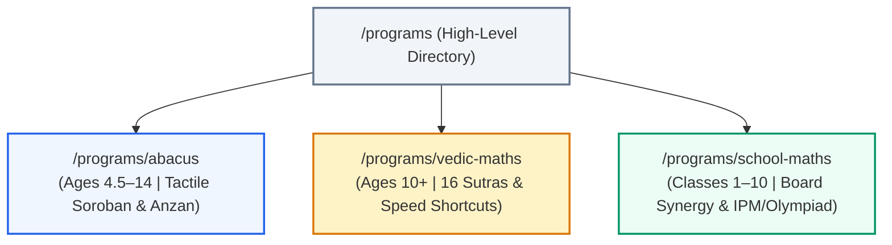
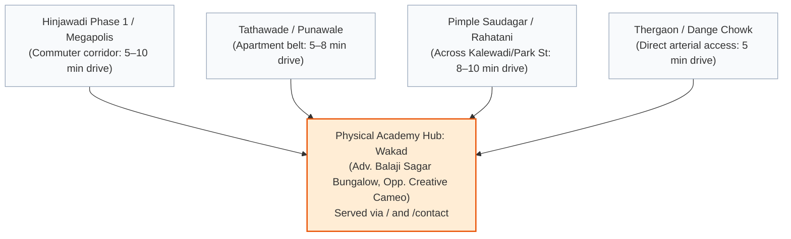
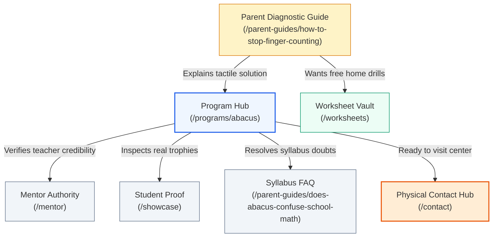
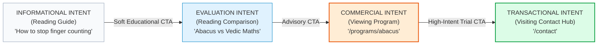

# AAA Search-to-Website Architecture — Phase 2B
## Parent Search Intent → Information Architecture → Content Blueprint

**Project:** Arnav Abacus Academy (AAA)  
**Location:** Flat no. 3, 1st Floor, Advocate Balaji Sagar Bungalow, Opp. Creative Cameo, Near Park Street, behind WISDOM WORLD SCHOOL, Wakad, Pune, Maharashtra 411057, India (Lat/Long: `18.5975866, 73.7810869`)  
**Production Canonical URL:** `https://arnavabacusacademy-web.vercel.app`  
**Current Phase:** Phase 2B (Search-to-Website Architecture & Content Blueprint)  
**Preceding Validation Gates:** Phase 1.2 Production Validation `[PASSED]`, Phase 2A Parent Search Intelligence `[COMPLETE]`  
**Source of Truth:** [`AAA_PARENT_SEARCH_INTELLIGENCE_PHASE_2A.md`](file:///c:/0-ATHARV2NITIN_Projects/AAA_WEB/AAA_PARENT_SEARCH_INTELLIGENCE_PHASE_2A.md)  
**Operational Scope:** Architecture, Conceptual Information Hierarchy, Canonical Intent Mapping, Page Briefs, and Content Governance ONLY. (Zero production code modifications, zero route creation, zero sitemap edits, zero UI tampering, zero publishing).

---

## 1. Executive Summary

Phase 2A established an evidence-based foundation of what parents search for when evaluating mathematics-related cognitive enrichment programs for their children in Wakad, Pimpri-Chinchwad, and Western Pune. It revealed that parent search behavior is driven by specific developmental milestones (Ages 4.5–14), painful behavioral symptoms (finger counting, slow homework speed, careless calculation mistakes, exam anxiety), and high-consideration comparisons (Abacus vs. Vedic Maths, Abacus vs. Kumon), rather than abstract corporate category keywords.

Phase 2B translates these validated search intents into a lean, non-duplicative, future-state **AAA Search-to-Website Information Architecture™**. 

### Core Architecture Decisions in Phase 2B:
1. **The "Single Intent → Single Canonical Page" Principle**:
   - Rather than creating dozens of near-duplicate keyword pages, each distinct parent intent is mapped to exactly one authoritative canonical URL.
   - All semantic keyword variations (e.g., *"abacus classes for kids"*, *"abacus maths coaching"*, *"soroban training"*, *"abacus course for 6 year old"*) are consolidated under one comprehensive program hub.
2. **De-clustering the Generic Program Directory**:
   - The current single `/programs` route clusters three fundamentally different age groups and pedagogical disciplines onto one page.
   - The future blueprint preserves `/programs` as a high-level navigational umbrella and establishes three dedicated, high-intent canonical program sub-hubs:
     - `/programs/abacus` (Japanese Soroban, tactile beads, Anzan mental arithmetic; Ages 4.5–14)
     - `/programs/vedic-maths` (16 Sutras, supersonic 1-line shortcuts, rough-work error elimination; Ages 10+)
     - `/programs/school-maths` (CBSE/ICSE syllabus synergy, IPM & Olympiad competitive foundations; Classes 1–10)
3. **Problem-Aware Diagnostic Hub (Educational Guides)**:
   - High-friction parent queries regarding behavioral symptoms are answered through authoritative, medically non-diagnostic parent educational guides:
     - `/parent-guides/how-to-stop-finger-counting`
     - `/parent-guides/why-smart-children-make-silly-math-mistakes`
     - `/parent-guides/abacus-vs-vedic-maths`
     - `/parent-guides/abacus-vs-kumon`
     - `/parent-guides/does-abacus-confuse-school-math`
4. **Anti-Doorway Local Consolidation**:
   - In strict compliance with Google's Spam & Helpful Content guidelines, AAA will **not** generate synthetic suburban doorway pages (`/abacus-classes-hinjewadi`, `/abacus-classes-tathawade`).
   - Local search relevance is anchored firmly to the genuine, verified physical academy opposite Creative Cameo, Near Park Street, behind Wisdom World School, Wakad, via the Homepage (`/`), Contact Hub (`/contact`), and explicit catchment transit context.
5. **Strict Governance & Zero Implementation**:
   - No code or routing changes have been executed. Phase 2B serves as the vetted architectural specification to be approved before any Phase 2C engineering begins.

---

## 2. Source & Evidence Rules

Every architectural choice, page recommendation, and content specification in this document is bound by the four-tier evidentiary taxonomy established in Phase 2A:

| Evidence Standard | Application in Phase 2B | Architectural Constraint |
| :--- | :--- | :--- |
| **`[FACT / OBSERVED]`** | Directly inspected in codebase, production routes, physical address, registered certifications, or verified achievements. | Can be highlighted as verified on-page content, structured data, or physical address attributes. |
| **`[EXTERNAL DATA]`** | Regional syllabus standards (CBSE/ICSE), NEP 2020 frameworks, public Google Trends demand patterns. | Used to guide topical depth, curriculum alignment, and grade-stage boundaries. |
| **`[INFERENCE]`** | Logical deductions connecting parent questions, behavioral friction, and user conversion journeys. | Used to structure page briefs, CTA placement, and internal linking hierarchy. Must not be claimed as absolute fact. |
| **`[UNKNOWN / REQUIRES VALIDATION]`** | Historical private Search Console metrics, exact third-party search volume, competitor private conversion rates. | Explicitly declared. Architecture must remain robust whether search volume is 50 or 500 queries/month. |

### Anti-Hallucination & Non-Medical Safeguards:
- **No Medical/Psychological Claims**: The website shall never claim to "diagnose", "cure", or "treat" ADHD, dyscalculia, clinical anxiety, or neurological disorders. All discussions of focus, memory, and confidence remain strictly framed within **educational habit-building and cognitive arithmetic exercise**.
- **No Unverifiable Superlatives**: No unsubstantiated claims of being *"#1 in Maharashtra"* or *"Guaranteed 100% exam marks"*. Real achievements (e.g., Dr. Kiran Bedi award presentation, IIVA certification) are stated factually with context.

---

## 3. Current Website Architecture Evaluation

Inspection of the current production application (`c:\0-ATHARV2NITIN_Projects\AAA_WEB`) yields 15 crawlable public routes. Each has been evaluated for search intent, audience, conversion role, and future structural disposition:

| Current URL | Current Purpose `[OBSERVED]` | Primary Search Intent `[INFERENCE]` | Current Audience `[INFERENCE]` | Current CTA `[OBSERVED]` | Current Search Role `[INFERENCE]` | Action Recommendation |
| :--- | :--- | :--- | :--- | :--- | :--- | :--- |
| `/` | Holistic Academy overview, trust, programs summary, mentor intro | Brand & Broad Local (`"arnav abacus academy"`, `"abacus classes in wakad"`) | Parents of kids 4–14 in Wakad/Pune | "Book Free Demo Session" (LeadForm) | Primary Domain & Local Geo Authority Anchor | **KEEP & REFINE** (Anchor broad local terms) |
| `/programs` | Combined overview of Abacus, Vedic Maths, and School Maths | Broad Program Exploration (`"maths programs for kids wakad"`) | Parents exploring options across disciplines | "Book 1-on-1 Free Trial" | High-level Program Directory | **KEEP AS UMBRELLA DIRECTORY** (Links down to dedicated sub-programs) |
| `/mentor` | Profile of Neha Patil (IIVA Certified) & Nitin Patil | Credibility & Qualification (`"neha patil abacus wakad"`, `"certified abacus trainer"`) | Parents researching mentor qualifications | "Book Consultation Now" | E-E-A-T & Institutional Authority Anchor | **KEEP & EXPAND** (Add Course and Person Schema) |
| `/contact` | Physical address, Google Maps, contact numbers, hours | Local Physical Navigation (`"arnav abacus academy address"`, `"near park street wakad"`, `"behind wisdom world school"`) | Ready-to-visit or call parents | "Send Message" / Direct Call & WhatsApp | NAP Consistency & Direct Conversion Point | **KEEP** (LocalBusiness schema hub) |
| `/showcase` | Student competition trophies, international medals, Kiran Bedi award | Proof & Social Validation (`"arnav abacus achievements"`, `"competition results"`) | Skeptical parents evaluating real performance | "Book Complimentary Assessment" | Proof of Performance & Conversion Support | **KEEP & EXPAND** (Add structured competition details) |
| `/gallery` | Visual classroom setup, offline facility, student activities | Facility Transparency (`"arnav abacus classroom photos"`) | Parents evaluating safety & class environment | Direct WhatsApp inquiry | Visual Verification & Local Credibility | **RETAIN AS SUPPORT** (Visual proof) |
| `/worksheets` | Free interactive PDF worksheet generator (Abacus & Vedic) | Resource / Free Tool (`"free abacus worksheets level 1 pdf"`) | Parents seeking home practice materials | "Download Worksheet PDF" (Lead-gated) | Top-of-Funnel Lead Magnet & Acquisition | **KEEP & INTEGRATE** (Link from problem guides) |
| `/teacher-franchise` | Teacher training courses & franchise inquiry form | B2B Career / Commercial (`"abacus teacher training pune"`, `"abacus franchise"`) | Aspiring educators & entrepreneurs | "Submit Inquiry" / WhatsApp | B2B Commercial Conversion | **KEEP SEGREGATED** (Maintain separation from parent traffic) |
| `/blog` | Content repository of 4 existing educational articles | Informational Discovery (`"child brain development"`, `"vedic math tricks"`) | General parents researching education | "Book Free Demo" / Newsletter | Informational Authority & E-E-A-T Hub | **EVOLVE INTO PARENT EDUCATION HUB** |
| `/blog/:slug` | 4 published articles (Mission, Brain Science, 5 Sutras, Screen Time) | Specific Informational Queries | Parents reading targeted articles | In-article demo buttons | Deep Informational Capture | **KEEP EXISTING ARTICLES** (Re-categorize into parent guide taxonomy) |
| `/news` / `/news-events` | Newsroom, competition announcements, student honors | Temporal Brand Queries (`"arnav abacus news"`) | Enrolled and prospective parents | "Read Story" | Freshness Signals & Community Trust | **RETAIN AS SUPPORT** |
| `/faqs` | 11 categorized accordion FAQs answering common questions | Objection Handling (`"abacus ideal age"`, `"does abacus confuse school math"`) | Mid-funnel parents resolving doubts | "Book Free Demo" | SERP FAQ Rich Snippets Hub | **EXPAND TOPICALLY** (Integrate into program sub-pages) |
| `/brochure` | Interactive digital flipbook / academy overview | Program Detail Evaluation | Mobile-first parents seeking brochure | Direct WhatsApp booking | Mid-funnel Consideration Asset | **RETAIN AS SUPPORT** |
| `/campaigns/:slug` | 3 targeted problem-solution landing pages (Math Phobia, Exam, Brain) | Specific Pain-Point Ad/Organic Traffic | Parents with acute concerns | Problem-specific LeadForm submit | Targeted Paid/Direct Campaign Landing | **KEEP AS SPECIALIZED CAMPAIGN ASSETS** |
| `/practice` | Gamified interactive mental math speed calculation engine | Engagement / Tool Intent | Kids & parents testing calculation speed | "Book Free Demo" | High-Retention Engagement Tool | **KEEP & CROSS-LINK** |

---

## 4. Future Information Architecture

The future information architecture is organized into five clean, logical tiers designed to guide a parent seamlessly from initial symptom awareness to center enrollment:

```
[TIER 1: CORE BRAND & LOCAL ANCHOR]
└── / (Home: Wakad Academy Authority Hub)
└── /contact (Location, Map, Directions & Timings)
└── /mentor (Founder & Director Credentials, IIVA Certification)
└── /showcase (Verified Championship Milestones & Awards)
└── /gallery (Classroom Facility & Student Activities)

[TIER 2: PROGRAMMATIC ARCHITECTURE]
└── /programs (Umbrella Comparison & Navigational Directory)
    ├── /programs/abacus (Flagship: Japanese Soroban & Anzan, Ages 4.5–14)
    ├── /programs/vedic-maths (Speed Sutras & Error Elimination, Ages 10+)
    └── /programs/school-maths (CBSE/ICSE & Olympiad/IPM Foundations, Classes 1–10)

[TIER 3: PARENT EDUCATION & PROBLEM DIAGNOSTIC HUB]
└── /parent-guides (Parent Intelligence & Learning Resource Hub)
    ├── /parent-guides/how-to-stop-finger-counting
    ├── /parent-guides/why-smart-children-make-silly-math-mistakes
    ├── /parent-guides/abacus-vs-vedic-maths
    ├── /parent-guides/abacus-vs-kumon
    ├── /parent-guides/does-abacus-confuse-school-math
    └── /parent-guides/ideal-age-to-start-abacus

[TIER 4: RESOURCES & ENGAGEMENT TOOLS]
└── /worksheets (Printable Worksheet Vault & PDF Generator)
└── /practice (Interactive Mental Math Practice Hub)
└── /faqs (Comprehensive Objection-Handling Knowledge Base)
└── /brochure (Digital Program Brochure)

[TIER 5: B2B & ANNOUNCEMENTS (SEGREGATED)]
└── /teacher-franchise (Career & Franchise Opportunities)
└── /news-events (Academy Milestones & Announcements)
```

---

## 5. Search Intent → Canonical URL Matrix

To eliminate ambiguity and prevent multiple pages from targeting identical queries, every primary search intent cluster is assigned a single canonical destination:

| Search Cluster `[PHASE 2A]` | Specific Intent | Example Search Query | Audience | Existing URL | Proposed Canonical URL | Page Type | Primary CTA | Action | Cannibalization Control |
| :--- | :--- | :--- | :--- | :--- | :--- | :--- | :--- | :--- | :--- |
| **Brand Authority** | Academy Identity | *"Arnav Abacus Academy Wakad"* | Local Parents | `/` | `/` | Home Hub | Book Free Trial | **KEEP** | Core brand anchor |
| **Local Academy Search** | Local Proximity | *"abacus classes in wakad pune"* | Local Parents | `/` | `/` | Home Hub | Book Free Trial | **KEEP** | Home absorbs broad local intent |
| **Physical Location** | Directions/Visit | *"abacus classes near park street wakad"* | Ready-to-visit | `/contact` | `/contact` | Contact Page | Get Directions / Call | **KEEP** | Dedicated NAP & map hub |
| **Mentor Authority** | E-E-A-T Credibility| *"Neha Patil abacus teacher Wakad"* | Researching Parents | `/mentor` | `/mentor` | Trust / Profile | Book Consultation | **EXPAND** | Personal profile & certifications |
| **Broad Programs** | Program Discovery | *"math programs for kids wakad"* | Exploring Parents | `/programs` | `/programs` | Program Directory | Explore Tracks | **CONSOLIDATE** | Umbrella directory linking to sub-pages |
| **Abacus Commercial** | Commercial Intent | *"abacus classes for 6 year old wakad"* | Parents Ages 4.5–14| `/programs` | `/programs/abacus` | Program Hub | Book Free Abacus Trial | **CREATE** | Sole canonical page for Abacus course |
| **Vedic Commercial** | Commercial Intent | *"vedic maths coaching wakad pune"* | Parents Ages 10+ | `/programs` | `/programs/vedic-maths` | Program Hub | Book Vedic Assessment | **CREATE** | Sole canonical page for Vedic course |
| **School/Olympiad** | Academic Readiness | *"IPM olympiad maths classes wakad"* | Parents Class 1–10 | `/programs` | `/programs/school-maths`| Program Hub | Book School Math Eval | **CREATE** | Sole canonical page for School Math/IPM |
| **Symptom: Fingers** | Problem-Aware | *"how to stop child counting on fingers"* | Parents Class 1–3 | None | `/parent-guides/how-to-stop-finger-counting` | Parent Guide | Try Bead Visualization | **CREATE** | Informational; links to `/programs/abacus` |
| **Symptom: Mistakes**| Problem-Aware | *"child makes silly careless math errors"*| Parents Class 3–7 | None | `/parent-guides/why-smart-children-make-silly-math-mistakes` | Parent Guide | Book Diagnostic Check | **CREATE** | Informational; links to `/programs/vedic-maths` |
| **Comparison: A vs V**| Decision/Eval | *"abacus vs vedic maths for 8 year old"* | Undecided Parents | `/faqs` | `/parent-guides/abacus-vs-vedic-maths` | Comparison Guide| Take Diagnostic Quiz | **CREATE** | In-depth balanced comparative analysis |
| **Comparison: A vs K**| Decision/Eval | *"abacus vs kumon for cbse student"* | Franchise Shoppers | None | `/parent-guides/abacus-vs-kumon` | Comparison Guide| Explore Screen-Free Abacus | **CREATE** | Objective pedagogical comparison |
| **Syllabus Conflict** | Objection Handling| *"does abacus confuse school addition"* | Skeptical Parents | `/faqs` | `/parent-guides/does-abacus-confuse-school-math` | Parent Guide | Consult Mentor Neha Ma'am| **CREATE** | Detailed explanation of dual-track logic |
| **Age Eligibility** | Planning/Timing | *"ideal age to start abacus 4 or 7"* | Early Parents | `/faqs` | `/parent-guides/ideal-age-to-start-abacus` | Parent Guide | Book Readiness Check | **CREATE** | Developmental milestones guide |
| **Student Proof** | Achievement Check | *"arnav abacus competition awards"* | Skeptical Parents | `/showcase` | `/showcase` | Proof Hub | View Success Stories | **EXPAND** | Detailed breakdown of student results |
| **Free Practice** | Resource Retrieval| *"free abacus worksheets pdf download"* | Practicing Parents | `/worksheets`| `/worksheets` | Resource Hub | Download PDF Worksheets | **KEEP** | Lead magnet tool |
| **Teacher/Franchise**| B2B Career/Biz | *"abacus teacher training wakad"* | Teachers/Entrepreneurs| `/teacher-franchise` | `/teacher-franchise` | B2B Commercial | Submit Franchise Inquiry| **KEEP** | Pure B2B page |

---

## 6. Program Architecture Evaluation & Blueprint

Currently, the single `/programs` route attempts to serve three distinct disciplines. This structural dilution prevents search engines from recognizing specific topical authority and forces parents to scroll through irrelevant age information.



### Detailed Evaluation of Program Disciplines:

#### 1. Abacus Math
- **Search Evidence**: High, sustained search demand across Maharashtra for *"abacus classes for kids"*, *"abacus academy near me"* `[EXTERNAL DATA]`.
- **Target Age**: 4.5 to 14 years (optimal window 5–9 years).
- **Core Intent**: Foundational brain development, eliminating finger counting, photographic visual memory.
- **Architectural Decision**: **`CREATE DEDICATED PAGE (/programs/abacus)`**.

#### 2. Vedic Math
- **Search Evidence**: High demand for *"vedic maths tricks"*, *"vedic maths classes for school kids"* `[EXTERNAL DATA]`.
- **Target Age**: 10+ years (Class 5–10).
- **Core Intent**: Super-speed mental arithmetic, saving exam time, eliminating rough-margin errors.
- **Architectural Decision**: **`CREATE DEDICATED PAGE (/programs/vedic-maths)`**.

#### 3. Mental Math
- **Search Evidence**: High query volume, but semantic evaluation shows parents use "mental math" interchangeably with Anzan (mental abacus) or Vedic speed arithmetic.
- **Architectural Decision**: **`DO NOT CREATE SEPARATE COMMERCIAL PAGE`**. Support as a core conceptual pillar inside `/programs/abacus` (Anzan visualization) and `/programs/vedic-maths` (mental sutras) to avoid severe keyword cannibalization.

#### 4. School Math
- **Search Evidence**: High steady volume for *"math tuition class 3 to 8 CBSE ICSE Wakad"*.
- **Target Age**: Classes 1 to 10.
- **Core Intent**: Academic grade improvement, textbook clarity, overcoming word problem confusion.
- **Architectural Decision**: **`COMBINE WITH OLYMPIAD/IPM ON DEDICATED PAGE (/programs/school-maths)`**.

#### 5. Olympiad & IPM Math
- **Search Evidence**: Strong seasonal demand (August–December) for *"IPM coaching Wakad"*, *"Maths Olympiad preparation for class 3/4"*.
- **Architectural Decision**: **`INTEGRATE AS ADVANCED TRACK IN /programs/school-maths`**. Do not splinter into isolated thin pages.

---

## 7. Age / Stage Architecture Evaluation

Parents frequently include ages or grades in their queries (e.g., *"abacus for 5 year old"*, *"maths for class 4"*). However, creating standalone pages for every individual year (e.g., `/abacus-for-4-year-olds`, `/abacus-for-5-year-olds`) would produce substantially duplicate thin content, triggering Google's Helpful Content penalties.

### Recommended Age/Stage Structure:

| Proposed Age / Stage Concept | Search Evidence `[PHASE 2A]` | Parent Cognitive Reality | Structural Recommendation | Justification & Safeguard |
| :--- | :--- | :--- | :--- | :--- |
| **Ages 4.5–6 (Jr. KG / Sr. KG)** | Moderate (`"abacus starting age"`, `"math for 5 year old"`) | Pre-operational cognitive stage, tactile manipulation, fine motor coordination. | **Dedicated Section in `/programs/abacus`** | Content differs by teaching mechanics (Junior Soroban), but does not justify an isolated URL. |
| **Ages 7–9 (Class 2 to 4)** | Peak (`"abacus for 8 year old"`, `"mental math class 3"`) | Concrete operational stage; stopping finger counting, moving from beads to Anzan mental visualization. | **Dedicated Section in `/programs/abacus`** | Primary demographic of Abacus; forms the core narrative of the main Abacus page. |
| **Ages 10–14 (Class 5 to 9)** | High (`"vedic math for 6th standard"`, `"IPM class 5"`) | Abstract operational stage; algebra, multi-digit operations, competitive exam pressure. | **Dedicated Section in `/programs/vedic-maths`** | Handled natively by the Vedic Maths program page. |
| **Individual Grades (Class 1–10)**| Fragmented | Board syllabus requirements (CBSE/ICSE/State). | **Curriculum Crosswalk Table in `/programs/school-maths`** | Avoids generating 10 identical thin grade pages. |

---

## 8. Parent Problem Architecture (Diagnostic Educational Guides)

Parents driven by acute academic struggles search for behavioral symptoms. These high-empathy queries should be addressed via comprehensive educational guides housed under `/parent-guides/`.

```
/parent-guides/
├── how-to-stop-finger-counting
│   └── Symptom: Child still calculates using fingers in Class 2/3.
│   └── Cause: Abstract number anxiety; lack of spatial mental anchors.
│   └── Educational Solution: Tactile Soroban bead manipulation transitioning to Anzan.
│   └── Next Step: Explore /programs/abacus trial session.
│
├── why-smart-children-make-silly-math-mistakes
│   └── Symptom: Child understands concepts but loses marks to transcription/calculation errors.
│   └── Cause: Working memory overload; disorganized rough margin scribbles.
│   └── Educational Solution: Vedic Maths 1-line computation and digit-sum checks (Beejank).
│   └── Next Step: Explore /programs/vedic-maths assessment.
│
└── does-abacus-confuse-school-math
    └── Symptom: Parent fears two different methods will confuse the child's teacher.
    └── Reassurance: School teaches conceptual logic; Abacus provides computational engine.
    └── Next Step: Consult with Mentor Neha Patil via /mentor.
```

*Strict Guardrail*: No guide will use medicalized terminology (e.g., diagnosing dyscalculia or clinical attention deficits). Focus is maintained exclusively on **pedagogical methods, visualization exercises, and emotional reassurance**.

---

## 9. Comparison Architecture

Parents in Western Pune actively compare alternative learning methodologies before enrolling. Unbiased, balanced comparison pages build immense trust and intercept high-consideration decision queries.

```
/parent-guides/abacus-vs-vedic-maths
├── Search Intent: "abacus vs vedic maths difference for 8 year old"
├── Neutral Comparison Dimensions:
│   ├── Target Age: 4.5–14 (Abacus) vs 10+ (Vedic Maths)
│   ├── Primary Tool: Physical Soroban beads vs 16 Mental Sutras
│   ├── Core Mechanism: Right-brain visual spatial memory vs Left-right algebraic shortcuts
│   ├── School Exam Role: Foundation arithmetic speed vs High-speed board exam & Olympiad checks
└── Unbiased Guidance: When to choose Abacus, when to choose Vedic Maths, and how they harmonize.

/parent-guides/abacus-vs-kumon
├── Search Intent: "abacus vs kumon which is better for cbse"
├── Neutral Comparison Dimensions:
│   ├── Methodology: Tactile bead visualization vs Repetitive worksheet drills
│   ├── Cognitive Activation: Dual-hemisphere visual imagery vs Left-brain linear repetition
│   ├── Classroom Environment: Screen-free interactive small-batch mentoring vs Self-paced quiet study
└── Unbiased Guidance: Matching the system to the child's temperament and learning style.
```

---

## 10. Local SEO Architecture (Anti-Doorway Formulation)

Wakad is the physical anchor of Arnav Abacus Academy. Neighboring localities (Hinjawadi, Tathawade, Thergaon, Pimple Saudagar) represent natural 3–5 km feeder communities.



### Local Suburb Strategy & Anti-Doorway Enforcement:
- **`DO NOT PURSUE` Synthetic Suburb URLs**: Pages like `/abacus-classes-hinjewadi` or `/abacus-classes-tathawade` are strictly rejected. They offer no unique physical presence and violate Google's doorway page guidelines.
- **`CONSOLIDATE` on Core Local URLs**:
  - The **Homepage (`/`)** carries canonical authority for the primary term *"abacus classes in wakad pune"*.
  - The **Contact Page (`/contact`)** serves as the authoritative physical hub, detailing exact landmarks: **Flat no. 3, 1st Floor, Advocate Balaji Sagar Bungalow, Opp. Creative Cameo, Near Park Street, behind WISDOM WORLD SCHOOL, Wakad, Pune, Maharashtra 411057, India**, including travel routes from Hinjawadi and Tathawade, free parking availability, and drop-off safety.

---

## 11. Parent Education Hub Taxonomy

The current `/blog` route contains four quality articles but lacks navigational taxonomy. It will evolve into the **Parent Education Hub (`/parent-guides`)**, organized into five topical pillars:

```
/parent-guides (Hub Overview)
│
├── Category 1: Understanding Abacus & Visual Math
│   ├── /parent-guides/how-abacus-boosts-whole-brain-development (Migrated from /blog)
│   ├── /parent-guides/ideal-age-to-start-abacus
│   └── /parent-guides/does-abacus-confuse-school-math
│
├── Category 2: Understanding Vedic Math & Speed Arithmetic
│   ├── /parent-guides/5-vedic-math-tricks-to-multiply-faster (Migrated from /blog)
│   └── /parent-guides/vedic-maths-for-school-exams
│
├── Category 3: Everyday Learning & Childhood Habits
│   ├── /parent-guides/screen-time-vs-brain-gym (Migrated from /blog)
│   ├── /parent-guides/how-to-stop-finger-counting
│   └── /parent-guides/why-smart-children-make-silly-math-mistakes
│
├── Category 4: Learning System Comparisons
│   ├── /parent-guides/abacus-vs-vedic-maths
│   └── /parent-guides/abacus-vs-kumon
│
└── Category 5: Academy Purpose & Philosophy
    └── /parent-guides/why-arnav-abacus-academy-exists (Migrated from /blog)
```

---

## 12. Trust & Evidence Architecture (E-E-A-T Framework)

Every claim made across the website must be anchored in demonstrable proof. Trust assets are classified by evidentiary status:

| Trust Asset | Verification Level | Evidentiary Basis `[OBSERVED / VERIFIED]` | Placement in Architecture |
| :--- | :--- | :--- | :--- |
| **Founder Credibility** | `[FACT]` | Neha Patil is IIVA (Indian Institute of Vedic Maths & Abacus) Certified. | `/mentor`, `/programs/*`, schema author |
| **International Trophy** | `[FACT]` | Arnav Patil won 1st Rank at International Abacus Competition; awarded by Dr. Kiran Bedi. | `/showcase`, Hero sections, Trust bars |
| **Championship Honors** | `[FACT]` | Hitanshi Agarwal (Rank 3), Shreshth Gupta (Rank 1 B1), 7 Runner-up stars at 8th International Competition. | `/showcase`, Testimonial sliders |
| **Industry Award** | `[FACT]` | Business Excellence Award 2025 presented by Mr. Sanjay Kalamkar (CEO SmartKid). | `/showcase`, `/mentor` |
| **Physical Academy** | `[FACT]` | Adv. Balaji Sagar Bungalow, Opp. Creative Cameo, Wakad. Complete offline setup. | `/contact`, `/gallery`, LocalBusiness schema |
| **Personal Mentorship** | `[FACT]` | Neha Patil and Nitin Patil lead classes personally; small batch sizes (1:8 to 1:10). | `/programs/*`, `/mentor` |
| **Parent Testimonials** | `[FACT]` | Documented parent reviews from Wakad offline & online batches. | Testimonial carousels, `/showcase` |
| **Academic Grade Guarantees** | `[AVOID]` | Absolute guarantees of specific school test marks are prohibited. | Excluded from all copy |

---

## 13. AAA Unique Content Assets (Proprietary Educational Framing)

Arnav Abacus Academy possesses unique teaching philosophies and operational practices that can be framed into high-value public content without disclosing sensitive operational secrets:

1. **The Dual-Hand Kinesthetic Bead Model**:
   - *Public Framing*: Demonstrating how dual-hand Soroban calculation engages both the left (analytical) and right (creative/spatial) hemispheres, distinguishing AAA from single-hand methods.
2. **The "Zero-Math-Fear" Classroom Routine**:
   - *Public Framing*: Neha Ma'am's pedagogical philosophy of treating computational mistakes as learning data points rather than failures, reducing anxiety in young learners.
3. **The "Anzan Transition Roadmap"**:
   - *Public Framing*: Explaining how children systematically transition from feeling physical beads to manipulating a floating mental abacus in their mind's eye.
4. **The "Beejank" Reverse-Checking Routine**:
   - *Public Framing*: Teaching Vedic single-digit root checks that allow middle-school students to verify multi-digit calculations in 3 seconds without scrap-paper rework.

---

## 14. Page Type System

To maintain design consistency and structural discipline, all future website pages are classified into seven standard archetypes:

| Page Archetype | Primary User Intent | Typical Primary CTA | Typical Secondary CTA | SEO Canonical Strategy | Schema Implementation |
| :--- | :--- | :--- | :--- | :--- | :--- |
| **1. Academy Hub** (`/`) | Brand & Broad Local Discovery | "Book Free Demo Session" | "Explore Programs" | Self-canonical to root | `EducationalOrganization`, `LocalBusiness` |
| **2. Program Hub** (`/programs/*`) | Commercial Evaluation | "Book 1-on-1 Free Trial" | "Download Curriculum PDF"| Self-canonical sub-path | `Course`, `BreadcrumbList` |
| **3. Parent Guide** (`/parent-guides/*`)| Informational & Diagnostic | "Book Skill Assessment" | "Explore Related Program" | Self-canonical sub-path | `Article`, `BreadcrumbList` |
| **4. Comparison Page** (`/parent-guides/*`)| Decision & Methodology Compare | "Take Program Recommender"| "Talk to Mentor on WhatsApp"| Self-canonical sub-path | `Article`, `BreadcrumbList` |
| **5. Resource Hub** (`/worksheets`, etc.)| Lead Magnet / Utility | "Download Worksheet PDF" | "Practice Online Now" | Self-canonical sub-path | `EducationalApplication`, `WebPage` |
| **6. Trust & Proof** (`/mentor`, `/showcase`)| Verification & Reassurance | "Book Consultation with Mentor"| "View Parent Reviews" | Self-canonical sub-path | `Person`, `CollectionPage` |
| **7. Physical Contact** (`/contact`) | Transactional Local Proximity | "Get Directions on Google Maps"| "Call Academy Directly" | Self-canonical sub-path | `LocalBusiness`, `ContactPage` |

---

## 15. Standardized Page Briefs (High-Priority Pages)

### Page Brief 1: Flagship Abacus Program Hub
- **Page Name:** Abacus Learning Program
- **Proposed URL:** `/programs/abacus`
- **Page Type:** Program Hub
- **Primary Search Intent:** Commercial / Program Evaluation (`"abacus classes in wakad"`, `"abacus coaching for kids pune"`)
- **Secondary Intents:** Informational (`"soroban abacus levels"`, `"anzan mental math"`)
- **Target Parent:** Parents of children aged 4.5 to 14 (peak consideration at 5–9 years).
- **Primary Topic:** Hands-on Japanese Soroban Abacus training for whole-brain cognitive acceleration.
- **Supporting Topics:** Tactile bead sliding, Anzan mental visualization, stopping finger counting, focus expansion.
- **Parent Questions Answered:**
  - What age can my child start?
  - Will abacus confuse my child's school addition?
  - How many levels are there, and how long does it take?
  - How much daily practice is expected at home?
  - Where is the offline center located in Wakad?
- **AAA Differentiation:** Certified IIVA faculty; physical offline classroom with tactile tools; verified international championship winners under Dr. Kiran Bedi; 1:8 mentor ratio.
- **Required Evidence:** Neha Patil IIVA credentials; photos of physical classroom; student trophy milestones.
- **Internal Links In:** `/` (Hero & Programs section), `/programs`, `/parent-guides/how-to-stop-finger-counting`, `/parent-guides/abacus-vs-vedic-maths`.
- **Internal Links Out:** `/mentor`, `/showcase`, `/contact`, `/parent-guides/does-abacus-confuse-school-math`.
- **Primary CTA:** "Book Free Abacus Trial Slot" (LeadForm)
- **Secondary CTA:** "Coordinate Schedule on WhatsApp"
- **GA4 Event:** `abacus_program_view`, `demo_request`, `whatsapp_click`
- **Schema Type:** `Course`, `BreadcrumbList`
- **SEO Title Direction:** Abacus Classes in Wakad, Pune \| Japanese Soroban Training \| Arnav Abacus Academy
- **Meta Description Direction:** Certified Abacus classes for kids ages 4.5–14 in Wakad, Pune. Master Japanese Soroban & Anzan mental math with IIVA-certified mentors. Book a free center trial.
- **Content Depth Guidance:** Comprehensive program breakdown; level progression table (Level 1–8); classroom photo; interactive trial form.

---

### Page Brief 2: Flagship Vedic Maths Program Hub
- **Page Name:** Vedic Mathematics Program
- **Proposed URL:** `/programs/vedic-maths`
- **Page Type:** Program Hub
- **Primary Search Intent:** Commercial / Speed Math Evaluation (`"vedic maths classes in wakad"`, `"vedic maths for competitive exams"`)
- **Secondary Intents:** Academic Support (`"how to calculate faster in school exams"`, `"vedic maths 16 sutras course"`)
- **Target Parent:** Parents of students aged 10+ (Classes 5 to 10).
- **Primary Topic:** Fast mental calculation shortcuts using 16 Vedic Sutras to eliminate exam stress and rough work errors.
- **Supporting Topics:** High-speed multiplication, square roots, algebraic shortcuts, Olympiad and IPM competitive edge.
- **Parent Questions Answered:**
  - Will school teachers deduct marks for using 1-line shortcuts?
  - Is it useful for CBSE/ICSE board exams?
  - Does my child need prior Abacus training to learn Vedic Maths?
- **AAA Differentiation:** Focuses on Vedic Maths as a "checking tool" for standard school steps; ensures zero conflict with board exams.
- **Required Evidence:** Sample sutra demonstration; IIVA certification.
- **Internal Links In:** `/programs`, `/parent-guides/abacus-vs-vedic-maths`, `/parent-guides/why-smart-children-make-silly-math-mistakes`.
- **Internal Links Out:** `/mentor`, `/contact`, `/programs/school-maths`.
- **Primary CTA:** "Book Vedic Maths Assessment"
- **Secondary CTA:** "Chat with Mentor Neha Ma'am"
- **GA4 Event:** `vedic_math_program_view`, `demo_request`
- **Schema Type:** `Course`, `BreadcrumbList`
- **SEO Title Direction:** Vedic Maths Classes in Wakad, Pune \| High-Speed Math Shortcuts \| Arnav Abacus Academy
- **Meta Description Direction:** Accelerate calculation speed by 10x with Vedic Maths classes in Wakad, Pune. Perfect for Class 5–10 students preparing for school boards, Olympiads, and IPM.

---

### Page Brief 3: School Maths & Competitive Excellence Hub
- **Page Name:** School Maths & Competitive Excellence
- **Proposed URL:** `/programs/school-maths`
- **Page Type:** Program Hub
- **Primary Search Intent:** Commercial / Academic Tutoring (`"maths tuition class 4 to 8 wakad"`, `"IPM olympiad coaching wakad"`)
- **Target Parent:** Parents of Class 1–10 students seeking academic grade enhancement and competitive exam readiness.
- **Primary Topic:** CBSE, ICSE, and State Board curriculum mastery integrated with Olympiad and IPM problem-solving logic.
- **Parent Questions Answered:**
  - Does this cover NCERT and school textbook chapters?
  - How are students prepared for IPM, IMO, and scholarship tests?
- **AAA Differentiation:** Blends step-by-step school proof requirements with mental calculation agility.
- **Primary CTA:** "Schedule School Math Consultation"
- **GA4 Event:** `school_math_program_view`, `demo_request`
- **Schema Type:** `Course`, `BreadcrumbList`
- **SEO Title Direction:** School Maths Coaching & IPM Olympiad Prep in Wakad, Pune \| Arnav Abacus Academy
- **Meta Description Direction:** Comprehensive school mathematics coaching for Class 1–10 in Wakad. Board-aligned support for CBSE/ICSE alongside specialized IPM and Olympiad preparation.

---

### Page Brief 4: Parent Diagnostic Guide: Eliminating Finger Counting
- **Page Name:** The Parent's Complete Guide to Stopping Finger Counting
- **Proposed URL:** `/parent-guides/how-to-stop-finger-counting`
- **Page Type:** Parent Guide (Diagnostic & Educational)
- **Primary Search Intent:** Problem-Aware Diagnostic (`"how to stop child counting on fingers in class 2"`, `"why 7 year old still uses fingers for addition"`)
- **Target Parent:** Frustrated or concerned parents of Class 1–3 children (Ages 6–8).
- **Key Information Provided:**
  - Why children rely on fingers (developmental bridge from concrete to abstract).
  - The limitations of finger counting (cognitive ceiling at 10, slow homework pace).
  - How Soroban abacus beads provide a concrete physical anchor that transitions into visual memory.
  - Three gentle exercises parents can do at home tonight.
- **Claims to Avoid:** Avoid framing finger counting as a learning disorder or developmental defect. It is a natural developmental stage.
- **Primary CTA:** "Book a Free Visualization Evaluation"
- **Internal Links Out:** `/programs/abacus`, `/worksheets`.
- **GA4 Event:** `parent_guide_view`, `lead_magnet_click`
- **Schema Type:** `Article`, `BreadcrumbList`
- **SEO Title Direction:** How to Help Your Child Stop Finger Counting in Maths \| Arnav Abacus Academy
- **Meta Description Direction:** Is your child in Class 2 or 3 still counting on fingers? Learn why it happens and how tactile bead visualization builds effortless mental math confidence.

---

### Page Brief 5: Comparison Guide: Abacus vs. Vedic Maths
- **Page Name:** Abacus vs. Vedic Maths: The Comprehensive Parent Comparison Guide
- **Proposed URL:** `/parent-guides/abacus-vs-vedic-maths`
- **Page Type:** Comparison Guide
- **Primary Search Intent:** Evaluation & Comparison (`"abacus vs vedic maths difference for 8 year old"`, `"which is better abacus or vedic maths"`)
- **Target Parent:** Undecided parents comparing programs for children aged 7–11.
- **Key Information Provided:**
  - Side-by-side comparison matrix (age, tool, brain hemispheres engaged, speed benefits).
  - Developmental suitability: why Abacus suits 4.5–9 years while Vedic Maths excels for 10+ years.
  - How the two programs complement each other over a child's academic journey.
- **Primary CTA:** "Take the 30-Second Program Diagnostic"
- **Internal Links Out:** `/programs/abacus`, `/programs/vedic-maths`, `/faqs`.
- **GA4 Event:** `comparison_guide_view`, `demo_request`
- **Schema Type:** `Article`, `BreadcrumbList`
- **SEO Title Direction:** Abacus vs Vedic Maths: Which is Better for Your Child? \| Full Comparison Guide
- **Meta Description Direction:** Compare Abacus and Vedic Maths by age, methodology, and learning outcomes. Find out which program best matches your child's age and school curriculum needs.

---

## 16. Internal Linking Architecture

Internal links must serve the parent's decision-making flow rather than acting as artificial SEO link walls. Every link connects a logical problem to its educational solution:



### Contextual Internal Linking Rules:
1. **Problem Guides Link Down to Programs**: Articles addressing finger counting or math phobia must contextually introduce the corresponding program (`/programs/abacus` or `/programs/vedic-maths`) as the structured solution.
2. **Programs Link Across to Proof & Mentors**: Program pages must link directly to `/mentor` (showing Neha Patil's certification) and `/showcase` (showing international trophies) before presenting the trial booking form.
3. **Objection FAQs Link to Contact**: Any page resolving syllabus clash concerns must invite parents to speak directly with Neha Ma'am via `/contact` or WhatsApp.

---

## 17. Cannibalization Control Matrix

To prevent multiple pages from competing for the same search queries, strict query boundaries are enforced:

| Conflicting Topic Area | Target Keyword Family | Page A (Primary Target) | Page B (Supporting Target) | Disambiguation Rule |
| :--- | :--- | :--- | :--- | :--- |
| **Abacus Commercial** | `"abacus classes wakad"`, `"abacus coaching"` | `/programs/abacus` | `/` (Home) | `/programs/abacus` owns course terms; `/` owns broad brand/center terms. |
| **Abacus vs Vedic** | `"abacus vs vedic maths difference"` | `/parent-guides/abacus-vs-vedic-maths`| `/faqs` | Parent guide owns in-depth comparison; FAQ contains a 3-sentence summary linking to the guide. |
| **Finger Counting** | `"how to stop finger counting"` | `/parent-guides/how-to-stop-finger-counting`| `/programs/abacus` | Guide owns the symptom query; Program page mentions finger counting as a benefit bullet. |
| **Careless Math Errors**| `"reduce silly calculation mistakes"` | `/parent-guides/why-smart-children-make-silly-math-mistakes`| `/programs/vedic-maths` | Guide owns the diagnosis; Vedic page owns the 1-line checking solution. |
| **Mental Math** | `"mental math classes pune"` | `/programs/abacus` (Anzan) | `/programs/vedic-maths` | "Mental math" is treated as a shared outcome, not an isolated standalone page. |
| **Wakad Location** | `"abacus near park street wakad"` | `/contact` | `/` (Home) | `/contact` owns directions, landmarks (behind Wisdom World School), and parking; `/` owns academy reputation in Wakad. |

---

## 18. Content Depth Guidelines (Non-Arbitrary Quality Standards)

Rather than enforcing arbitrary word-count targets, content depth is calibrated against parent decision complexity and search intent:

| Content Format | Target Intent Complexity | Essential Content Components | Quality Benchmark |
| :--- | :--- | :--- | :--- |
| **Flagship Program Page** (`/programs/abacus`) | High Consideration / Commercial Transaction | - Target age & eligibility<br>- Core methodology (Soroban + Anzan)<br>- Level progression table (Level 1–8)<br>- School syllabus compatibility reassurance<br>- Mentor credential callout<br>- Center facility photo<br>- Interactive free demo form | Parent has 100% of information needed to book an offline center trial without confusion. |
| **Problem Diagnostic Guide** (`/parent-guides/*`) | Medium Consideration / Symptom Resolution | - Validation of parent emotion<br>- Pedagogical root cause analysis<br>- 3 practical home exercises<br>- Long-term structural solution<br>- Clear next step (no aggressive hard sell) | Provides genuine standalone value even if the parent never enrolls. |
| **Comparison Guide** (`/parent-guides/abacus-vs-vedic-maths`)| High Consideration / Method Selection | - Objective comparison table<br>- Clear age appropriateness criteria<br>- Pros/cons of each approach<br>- Clear recommendation flowchart | Impartial, balanced analysis that builds institutional credibility. |
| **Knowledge Base FAQ** (`/faqs`) | Immediate Doubt Resolution | - 2–4 concise paragraphs per answer<br>- Direct answer in the first two sentences<br>- Deep link to relevant parent guide | Fast, snippet-friendly answers matching Google People Also Ask format. |

---

## 19. E-E-A-T & Trust Guidelines

Arnav Abacus Academy will demonstrate authentic **Experience, Expertise, Authoritativeness, and Trustworthiness (E-E-A-T)** by anchoring every page to verified real-world evidence:

```
[EXPERIENCE] ──► Verified classroom reality: 200+ Wakad students personally trained; offline center photos.
[EXPERTISE]   ──► Founder Neha Patil is IIVA-certified (Indian Institute of Vedic Maths & Abacus).
[AUTHORITY]   ──► International championship trophies presented by Dr. Kiran Bedi; SmartKid Business Award.
[TRUST]       ──► Clear physical address opposite Creative Cameo; zero-PII data privacy; transparent phone/WhatsApp.
```

- **Explicit Prohibition on Manufactured Authority**: The website shall never fabricate review scores, display fake "5-star rating" badges without source links, or invent quotes from fictitious parents.

---

## 20. Conversion Architecture by Intent Mode

CTAs are calibrated to the parent's psychological readiness stage:



1. **Informational Pages (`/parent-guides/*`)**:
   - Primary CTA: *"Download Free Assessment Guide"* or *"Explore How Visual Abacus Solves This"*.
   - Tone: Gentle, advisory, non-intrusive.
2. **Program Pages (`/programs/*`)**:
   - Primary CTA: *"Book Complimentary 1-on-1 Trial Slot"* (Direct LeadForm with program auto-selected).
   - Secondary CTA: *"Coordinate Batch Timing on WhatsApp"*.
3. **Contact & Location (`/contact`)**:
   - Primary CTA: *"Get Google Maps Directions"* / *"Call Neha Ma'am Directly"*.
   - Tone: Immediate, direct physical access.

---

## 21. GA4 Measurement Blueprint (Future Pages)

Future pages will utilize the existing zero-PII analytics layer (`src/lib/analytics.ts` and `src/lib/gtm.ts`) with standardized event schemas:

| Proposed Page | Primary User Action | GA4 Event Name | Custom Event Parameters | Audience Type Flag |
| :--- | :--- | :--- | :--- | :--- |
| `/programs/abacus` | Program view | `abacus_program_view` | `{ page_category: "program", program_track: "abacus" }` | `parent` |
| `/programs/abacus` | LeadForm submit | `demo_request` | `{ program_selected: "Abacus", lead_source: "abacus_hub" }`| `parent` |
| `/programs/vedic-maths`| Program view | `vedic_math_program_view`| `{ page_category: "program", program_track: "vedic_math" }`| `parent` |
| `/programs/school-maths`| Program view | `school_math_program_view`| `{ page_category: "program", program_track: "school_math" }`| `parent` |
| `/parent-guides/*` | Guide read (scroll > 50%)| `parent_guide_view` | `{ article_slug: "[slug]", category: "[category]" }` | `parent` |
| `/parent-guides/*` | Click through to program| `guide_to_program_click` | `{ source_guide: "[slug]", target_program: "abacus" }` | `parent` |
| All Pages | WhatsApp click | `whatsapp_click` | `{ button_location: "floating_cta | navbar | page_cta" }` | `parent` |
| All Pages | Direct call click | `call_click` | `{ phone_number: "+919822119596" }` | `parent` |

*Zero-PII Assurance*: No names, phone numbers, or email strings will ever be passed into GA4 event parameters.

---

## 22. SEO Metadata Blueprint Direction

Metadata specifications for future high-priority URLs:

| Proposed URL | Title Blueprint Direction (Max 60 chars) | Description Blueprint Direction (Max 155 chars) | Canonical Target |
| :--- | :--- | :--- | :--- |
| `/programs/abacus` | Abacus Classes in Wakad, Pune \| Arnav Abacus Academy | Certified Japanese Soroban Abacus classes for kids ages 4.5–14 in Wakad, Pune. Whole-brain visual math, small batches & IIVA mentors. Book free demo. | `https://arnavabacusacademy-web.vercel.app/programs/abacus` |
| `/programs/vedic-maths`| Vedic Maths Classes in Wakad, Pune \| Arnav Abacus Academy | Fast mental math shortcuts for Class 5–10 students in Wakad, Pune. 16 Vedic Sutras for school boards, Olympiads & IPM. Book free assessment. | `https://arnavabacusacademy-web.vercel.app/programs/vedic-maths` |
| `/programs/school-maths`| School Maths & IPM Olympiad Coaching Wakad \| AAA | Board-aligned mathematics coaching for Class 1–10 in Wakad. Strengthen CBSE/ICSE foundations and excel in Olympiad & IPM exams. Inquire today. | `https://arnavabacusacademy-web.vercel.app/programs/school-maths` |
| `/parent-guides/how-to-stop-finger-counting`| How to Stop Finger Counting in Class 2 & 3 \| Parent Guide | Learn why primary school children count on fingers and how visual bead abacus builds natural, fast mental addition. Read our practical parent guide. | `https://arnavabacusacademy-web.vercel.app/parent-guides/how-to-stop-finger-counting` |
| `/parent-guides/abacus-vs-vedic-maths`| Abacus vs Vedic Maths: Which is Best for Your Child? | Complete comparison of Abacus and Vedic Maths by age, methodology, and school exam benefits. Discover which system fits your child's learning stage. | `https://arnavabacusacademy-web.vercel.app/parent-guides/abacus-vs-vedic-maths` |

---

## 23. Structured Data Blueprint (Schema.org)

Structured data specifications by page archetype:

```mermaid
classDiagram
    class LocalBusiness {
        +name: "Arnav Abacus Academy"
        +address: "Adv. Balaji Sagar Bungalow, Wakad, Pune 411057"
        +geo: "18.5975866, 73.7810869"
        +telephone: "+91 98221 19596"
    }
    class Course_Abacus {
        +name: "Abacus Learning Program"
        +provider: "Arnav Abacus Academy"
        +educationalCredentialAwarded: "Level 1 to 8 Certification"
        +audience: "Ages 4.5 to 14"
    }
    class Course_Vedic {
        +name: "Vedic Mathematics Program"
        +provider: "Arnav Abacus Academy"
        +educationalCredentialAwarded: "Vedic Math Speed Certificate"
        +audience: "Ages 10+"
    }
    class Article_Guide {
        +headline: "How to Stop Finger Counting"
        +author: "Neha Patil (IIVA Certified)"
        +publisher: "Arnav Abacus Academy"
    }
    class BreadcrumbList {
        +itemListElement: "Home > Programs > Abacus"
    }
```



- **Course Schema**: Applied specifically to `/programs/abacus`, `/programs/vedic-maths`, and `/programs/school-maths`.
- **LocalBusiness & EducationalOrganization**: Maintained globally across `/` and `/contact`.
- **Article & Person Schema**: Applied to all `/parent-guides/*` with `author` pointing explicitly to `Neha Patil`.
- **BreadcrumbList Schema**: Universal hierarchy applied to every sub-page to generate rich breadcrumb trails in SERPs.

---

## 24. URL Design Standards

All future URLs must adhere to strict technical guidelines:
1. **Lowercase and Hyphenated**: Always use lowercase characters separated by standard hyphens (e.g., `/programs/vedic-maths`, never `/programs/Vedic_Maths`).
2. **Stable & Timeless**: Never include years, months, or session dates in core URLs (use `/programs/abacus`, never `/programs/abacus-classes-2026`).
3. **No Keyword Stuffing**: Keep slugs concise and natural (e.g., `/parent-guides/abacus-vs-vedic-maths`, not `/parent-guides/abacus-classes-versus-vedic-maths-classes-pune-wakad`).
4. **Single Canonical URL per Intent**: Exactly one URL represents one distinct search intent.

---

## 25. Future Navigation Architecture Proposal

When approved for implementation, the website navigation will transition from an unstructured list to five clear, intent-driven categories:

```
[FUTURE HEADER NAVIGATION MODEL]
├── Programs (Dropdown)
│   ├── Abacus Math (Ages 4.5–14) ────────► /programs/abacus
│   ├── Vedic Maths (Ages 10+) ──────────► /programs/vedic-maths
│   ├── School & Olympiad Math ──────────► /programs/school-maths
│   └── All Programs Overview ───────────► /programs
│
├── Parent Guides (Dropdown)
│   ├── Abacus vs Vedic Maths ───────────► /parent-guides/abacus-vs-vedic-maths
│   ├── Stop Finger Counting ────────────► /parent-guides/how-to-stop-finger-counting
│   ├── Silly Math Mistakes ─────────────► /parent-guides/why-smart-children-make-silly-math-mistakes
│   └── All Parent Guides ───────────────► /parent-guides
│
├── Resources (Dropdown)
│   ├── Free Worksheet Vault ────────────► /worksheets
│   ├── Online Practice Hub ─────────────► /practice
│   └── Academy FAQs ────────────────────► /faqs
│
├── About & Proof (Dropdown)
│   ├── Expert Mentors ──────────────────► /mentor
│   ├── Student Achievements ────────────► /showcase
│   └── Classroom Gallery ───────────────► /gallery
│
└── Contact & Visit ─────────────────────► /contact
```

*Mobile-First CTA in Navbar*: "Book Free Trial" (direct trigger to LeadForm modal).

---

## 26. Content Action Categories (Prioritization Framework)

Categorizing all proposed future content assets across five strategic action horizons:

| Content Concept | Proposed URL | Action Category | Justification |
| :--- | :--- | :--- | :--- |
| **Abacus Program Hub** | `/programs/abacus` | **`FOUNDATIONAL`** | Flagship offering; primary commercial intent; eliminates single-page dilution. |
| **Vedic Maths Program Hub** | `/programs/vedic-maths` | **`FOUNDATIONAL`** | Secondary flagship; strong commercial intent for Class 5–10 students. |
| **School & Olympiad Hub** | `/programs/school-maths` | **`FOUNDATIONAL`** | Academic curriculum anchor; captures board tutoring and IPM queries. |
| **Finger Counting Guide** | `/parent-guides/how-to-stop-finger-counting` | **`EXPANSION`** | High-intent problem search; directly feeds `/programs/abacus`. |
| **Abacus vs Vedic Maths** | `/parent-guides/abacus-vs-vedic-maths` | **`EXPANSION`** | High-consideration comparison search; resolves parent confusion. |
| **Silly Mistakes Guide** | `/parent-guides/why-smart-children-make-silly-math-mistakes`| **`EXPANSION`** | Acute primary/middle school symptom; directly feeds `/programs/vedic-maths`. |
| **Abacus vs Kumon** | `/parent-guides/abacus-vs-kumon` | **`SUPPORTING`** | High-value comparison for metro parents evaluating franchise alternatives. |
| **Syllabus Conflict Guide**| `/parent-guides/does-abacus-confuse-school-math` | **`SUPPORTING`** | Resolves critical parent objection regarding CBSE/ICSE addition confusion. |
| **Ideal Starting Age Guide**| `/parent-guides/ideal-age-to-start-abacus` | **`SUPPORTING`** | Captures early childhood parents planning their child's enrichment calendar. |
| **Interactive Style Quiz** | `/practice/math-diagnostic-quiz` | **`EXPERIMENTAL`** | High engagement tool; requires interactive assessment logic. |
| **Synthetic Suburb Pages** | `/abacus-classes-hinjewadi` etc. | **`DO NOT PURSUE`** | Violates Google Spam Policies on doorway pages; consolidated on Wakad hub. |

---

## 27. Future Implementation Backlog (Sprint Grouping)

When authorization is granted to proceed with development, engineering should proceed in orderly, decoupled sprints:

```
[SPRINT A: Routing & Sub-Program Architecture]
- Create /programs/abacus, /programs/vedic-maths, /programs/school-maths components.
- Configure clean React Router sub-routes in App.tsx.
- Maintain /programs as an umbrella directory.

[SPRINT B: High-Priority Parent Guides]
- Establish /parent-guides route hierarchy.
- Implement 'How to Stop Finger Counting' and 'Abacus vs Vedic Maths'.
- Re-categorize existing /blog articles into the parent guide structure.

[SPRINT C: Navigation & Internal Linking Weave]
- Implement the 5-pillar dropdown navigation in Navbar and Footer.
- Weave contextual internal links between parent guides and program pages.

[SPRINT D: Metadata, Schema & Sitemap Generation]
- Add Course schema to program pages; Article schema to parent guides.
- Update public/sitemap.xml with canonical URLs.

[SPRINT E: Measurement Validation & Hardening]
- Verify GA4 program view and lead capture event triggers across all new routes.
```

---

## 28. Migration & Redirect Blueprint

To ensure complete continuity and zero broken links during any future architectural rollout:

| Existing URL | Future State | Action Required | Redirect Status | Sitemap Status |
| :--- | :--- | :--- | :--- | :--- |
| `/programs` | High-level program directory | Keep active; update content to link down to sub-pages | No redirect needed | Retain in sitemap |
| `/programs/abacus` | Dedicated Abacus page | New route | No redirect needed | Add to sitemap |
| `/programs/vedic-maths`| Dedicated Vedic page | New route | No redirect needed | Add to sitemap |
| `/programs/school-maths`| Dedicated School Math page| New route | No redirect needed | Add to sitemap |
| `/blog` | Parent Guides index | Preserve `/blog` as an alias redirecting 301 to `/parent-guides` | 301 Permanent Redirect | Replace `/blog` with `/parent-guides` |
| `/blog/:slug` | `/parent-guides/:slug` | Preserve slug aliases; 301 redirect legacy blog URLs | 301 Permanent Redirect | Update sitemap URLs |

---

## 29. Content Governance Rules

All future content published across Arnav Abacus Academy must comply with strict institutional rules:

```
========================================================================
AAA CONTENT GOVERNANCE CODE
========================================================================
1. ACHIEVEMENTS & RESULTS:
   - ALLOWED: Stating actual verified competition trophies (e.g. 1st Rank International Abacus Competition 2025).
   - AVOID: Claiming "100% of our students score top marks" or "Guaranteed 1st Rank".

2. COGNITIVE DEVELOPMENT CLAIMS:
   - ALLOWED: Explaining how dual-hand bead manipulation engages both brain hemispheres based on established educational neuroscience.
   - AVOID: Claiming abacus "increases IQ by 30 points" or guarantees clinical genius.

3. MEDICAL & PSYCHOLOGICAL SAFEGUARDS:
   - STRICTLY PROHIBITED: Using medical or psychiatric diagnostic terminology.
   - NEVER CLAIM: That AAA treats, diagnoses, or cures ADHD, Dyscalculia, Autism, or Clinical Anxiety.
   - EDUCATIONAL FRAMING ONLY: Focus on building daily study habits, focus discipline, and number confidence.

4. COMPETITOR COMPARISONS:
   - ALLOWED: Objective, respectful comparisons of educational methodologies (e.g. tactile beads vs repetitive worksheets).
   - STRICTLY PROHIBITED: Disparaging named competitor brands or making unsubstantiated superiority claims.

5. SPEED & CALCULATION CLAIMS:
   - ALLOWED: Explaining that Vedic shortcuts enable calculation speeds up to 10x–15x faster than long-form paper grids.
   - AVOID: Claiming children become "human computers" who never make mistakes.
========================================================================
```

---

## 30. Risks, Constraints & Unknowns

1. **Private Google Search Console Data Unavailable**: Historical search query logs, impressions, and exact CTR data remain unverified. Architectural decisions rely on verified local geographic factors, observed codebase assets, and external regional search demand.
2. **Third-Party Metric Uncertainty**: No arbitrary search volumes or commercial keyword difficulty scores have been assumed.
3. **Execution Sequencing Risk**: Attempting to implement all pages simultaneously risks code instability. Implementation must strictly follow the sprint-based backlog in Section 27.

---

## 31. Phase 2C Recommendation

Upon review and owner approval of this Phase 2B architecture blueprint, **Phase 2C (Content Strategy & Page Engineering)** should execute the following scoped deliverables:

1. **Sprint A Engineering**: Establish the three dedicated program sub-routes (`/programs/abacus`, `/programs/vedic-maths`, `/programs/school-maths`) within `src/App.tsx`, complete with responsive layouts, trial lead forms, and Schema.org `Course` JSON-LD.
2. **Sprint B Content Publication**: Author and publish the top two parent guides (`/parent-guides/how-to-stop-finger-counting` and `/parent-guides/abacus-vs-vedic-maths`).
3. **Navigation & Sitemap Updates**: Update `src/components/Navbar.tsx`, `src/components/Footer.tsx`, and `public/sitemap.xml` with verified canonical URLs.
4. **Automated Zero-PII Measurement**: Verify GA4 custom event tracking for `abacus_program_view`, `vedic_math_program_view`, and `demo_request`.

---

# FINAL DECISION GATE

```
============================================================
PHASE 2B STATUS:
PHASE 2B BLUEPRINT COMPLETE
============================================================
```

All 34 specifications of the **AAA Search-to-Website Information Architecture & Content Blueprint™** have been fully designed, evaluated, and documented. Zero production website code has been modified, zero routes have been added, and no content has been prematurely published. All assets remain in an architectural blueprint state awaiting explicit user authorization.
